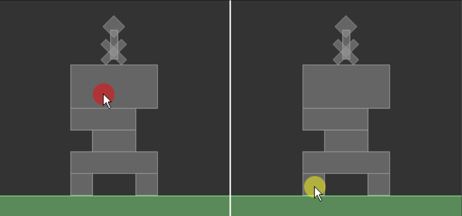
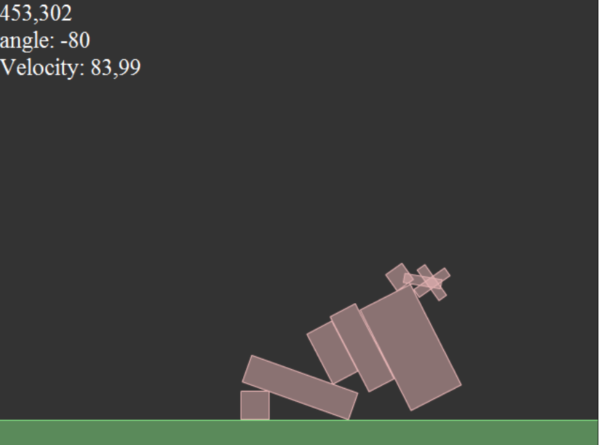

2D物理引擎 Box2D for javascript Games  第三章 刚体的交互

# 刚体的交互

基于Box2D的游戏都有各自的一套刚体交互方法。
图腾破坏者(Totem Destroyer)和红 砖移除(Red Remover)允许玩家通过鼠标点击来销毁刚体，然而愤怒的小鸟(Angry Birds)是通过拖拽使刚体(小鸟)飞行。
你已经知道怎样创建原始和复杂的刚体;
是时候来看看Box2D是怎样允许我们在世界中与刚体交互的。
在本章，你L将学习获u取Box2D的刚体信息进行交互的多种方式，包括:

- 通过鼠标选择刚体 

- 销毁刚体

- 对 刚体设置自定义属性

- 循环遍历世界中的所有刚体

- 获得刚体信息


通过本章的学习，你将有一个完全可玩的图腾破坏者关卡。我们与Box2D刚体最简单 并且最直观的交互方式是通过鼠标点击来销毁它们。

## 通过鼠标点击选择并销毁刚体

我们需要完成之前的图腾破坏者的关卡，所以这里将使用你在第二章，向世界添加
刚体中创建的脚本。你应该准备销毁顶部有神像的图腾。

1. Main() 方法中添加事件监听:
    ```
    document.querySelector('#canvas').addEventListener('click', destroyBrick)
    ```

    我不会去解释前面的这几行代码，因为它与Box2D无关并且你应该已经知 道怎样创建一个鼠标监听。

2. 事情变得越来越有趣了，在 destroyBrick() 方法中，它将被每一次鼠标点击调用:
    ```
    function destroyBrick(e){
      var px = e.pageX/worldScale;
      var py = e.pageY/worldScale;
      mousePVec = new b2Vec2(px/worldScale, py/worldScale);
      world.QueryPoint(queryCallback, new b2Vec2(px, py));
    }
    ```
    让我们来一行行的解释。首先前两行获取mouseX和mouseY的鼠标x和y位置的值，并依据 worldScale 变量，分别将它们的像素(pixels)转换为米 (meters)。这样变量pX和pY将存储我们刚刚点击的世界坐标(米)。
    现在，是时候来看看如果一个刚体在我们点击的点上。世界的QueryPoint()方 法查询世界中所有的夹具，找出在点上的夹具，然后如果有夹具在鼠标点击 的点上，于是我们可以说我们点击了一个夹具。
    让我们来看看QueryPoint()方法的参数;首先，是一个名字为 queryCallback 的回调函数，然后是一个作为b2Vec2对象的点坐标，它代表了转换的鼠标坐标。
3. queryCallback 方法是这个脚本的核心，它有一个参数，如果有的话，这个 参数是在鼠标点击的点上的夹具。因为一个点上可以有不止一个的夹具(试 想一下重叠的staitc类型的刚体)，如果你希望检查下一个夹具，那么你需要 让函数返回true，或者返回false将停止检查。

    目前，我们假设只可以有一个夹具在鼠标点击的点上，因此，我将如下这 样编写queryCallback()方法:

    ```
    function queryCallback(fixture){
      console.log(fixture)
    }
    ```

    此刻，我们只想要在输出窗口中输出一些一般的调试文本，所以，一旦
    你测试影片然后点击刚体，你将会看到下面的文本:
    ```
    b2Fixture{...}
    ```

    这意味着我们执行queryCallback()方法成功，然后我们可以确定用户点击 的夹具。

4. 不幸的是，只是知道夹具是不够的，因为我们需要知道我将要移除的刚体。你 可以使用GetBody()方法从夹具获得刚体，因此你可以将queryCallback()方法改 变成下面这样:

    ```
    function queryCallback(fixture){
      var touchedBody = fixture.GetBody();
      console.log(touchedBody)
    }
    ```
    
    如果你测试影片然后点击一个刚体，你将在输出窗口中看到下面的文本:

    ```
    b2Body{...}
    ```

    现在，我们知道了怎样获取玩家点击的刚体，是时候真正的开始销毁它 了。将一个刚体从世界中移除，使用世界的 DstroyBody() 方法然后你就能 打碎图腾了。

    ```
    function queryCallback(fixture){
      var touchedBody = fixture.GetBody();
      world.DestroyBody(touchedBody);
    }
    ```

6. 测试网页。点击砖块然后你就会看到砖块消失了，图腾被销毁了。
    

    源码在 `article/ch03/ch03-1.html`

总之，我们仍然有一个问题。在图腾破坏者中，不是所有的砖块都可以被销毁
的，但是目前如果你点击任何一个图腾砖块，你将销毁这个图腾砖块。
而且，你甚至可以销毁神像和地面。


看看之前的截图。左边的，我销毁了地面，这是错误的。右边，我销毁了最上面的
一块图腾砖块，原游戏关卡中，这块图腾是不可被销毁的。
这是个问题，我们需要找到一个办法，去告诉Box2D那一个刚体可以被销毁， 而且那一个刚体不可以被销毁。
幸运的是，Box2D的刚体定义很出色，我们甚至可以向刚体添加我们自定义的属性特征。

## 将自定义属性指定到刚体上

自定义属性可以是任何类型，但是目前我们只要添加字符串 breakable 为
可销毁的图腾砖块，以及 unbreakable 为不可销毁砖块。

1. 首先，我们向 brick() 方法传入一个字符串，因此，复制第一关的图
腾破坏者，我们将要向下面这样修改 main() 方法：

    ```
    function main(){
      world = new b2World(gravity, sleep);
      debugDraw();
      brick(275,435,30,30,"breakable"); 
      brick(365,435,30,30,"breakable"); 
      brick(320,405,120,30,"breakable");
      brick(320,375,60,30,"unbreakable");
      brick(305,345,90,30,"breakable");
      brick(320,300,120,60,"unbreakable");
      idol(320, 242);
      floor();
      setInterval(updateWorld, 1000 / 60);
      document.querySelector('#canvas').addEventListener('click', destroyBrick)
    }
    ```
2. 然后，让我们来看看怎样改变 brick() 方法
   
    ```
    function brick(px, py, w, h, s){
      var bodyDef = new b2BodyDef();
      bodyDef.position.Set(px/worldScale, py/worldScale);
      bodyDef.type = b2Body.b2_dynamicBody;
      bodyDef.userData = s;
      var polygonShape = new b2PolygonShape();
      polygonShape.SetAsBox(w/2/worldScale, h/2/worldScale);
      var fixtureDef = new b2FixtureDef();
      fixtureDef.shape = polygonShape;
      fixtureDef.density = 2;
      fixtureDef.restitution = .4;
      fixtureDef.friction = .5;
      var theBrick = world.CreateBody(bodyDef);
      theBrick.CreateFixture(fixtureDef);
    }
    ```
    这个字符串参数名为 s，正如你所看到的，当我创建刚体定义时，userData 属性来存储字符串。记住这个属性，因为在你的大多数的项目中，每当你需要
    存储指定的刚体数据时，你将需要它。
    为刚添加数据之后，当我们执行queryCallback()方法时，我们需要查看我们
    的刚体的userData属性的可销毁字符串（string）。
    只有在我们发现breakable时，我们将销毁刚体，然后当我们发现unbreakable
    时，我们可以选择输出一条消息，例如“you can't destroy this brick”。但是我
    并没有这样做，因为我只是想要销毁图腾砖块。

3. 向下面这样改变queryCallback()方法：
   
    ```
    function queryCallback(fixture){
      var touchedBody = fixture.GetBody();
      var userData = touchedBody.GetUserData();
      if (userData === "breakable") {
          world.DestroyBody(touchedBody);
      }
    }
    ```
    你可以通过GetUserData()方法获取自定义属性，因此，我们只要检查 breakable 值即可。

4. 测试，然后你将看到你只能销毁可销毁的图腾砖块。
   
    

    源码在 `article/ch03/ch03-2.html`

在前面的截图中，虽然左脚边的图腾砖块可以被销毁，但是如果你点击最大的那块图腾砖块它将不可被销毁。这都是关于正确的数据的存储和检索。

总之，设置和获取刚体的用户数据不只是有一种方法，我们必须检查关于我们刚体的信息。

在任何时候，我们可以扫描世界中所有的刚体然后获取它们的位置和旋转角度，以及它的速度和别的有用的信息。

## 遍历刚体并获取它们的属性

下一个示例将创建监视神像的一些种类的信息显示。在每一帧上，我们读取神像的位置，旋转角度以及熟读。这样，你可以根据神像的属性分派事件，例如：神像没有落地，要给与奖励，或者它从未达到一定的y轴速度，或者它移动到太左边等等。知道刚体的属性是非常有用的，当你想要为你的游戏添加皮肤时，以为你可以同步自定义绘制的资源与Box2D世界中发生的事情。

一步步来，让我们先从神像的监视器开始。我们将神像的数据显示在一个动态的文本框，因此我们需要对我们的类做一些基础的改动。

1. 添加一个 id 为 textMon 的 div 用于显示信息，文本框样式你自己随便设置，我把文本样式设为了白色绝对定位在了左上角

    ```
    <div class="info" id="textMon"></div>

    ```
    现在，我们需要一种方法来识别神像。可以使用我们刚刚使用的那个方法，使用 userData 属性。
    
2. 所以，我们按照和之前向图腾砖块添加属性时一样的方式，为神像添加属性，我们使用 idol 作为属性值，而不是 breakable 或 unbreakable。
    在 function idol(px, py){} 方法内添加： 

    ```
    bodyDef.userData="idol";
    ```
3. 现在，我们将核心的脚本代码插入 updateWorld() 方法：

    ```
    var radToDeg = 180 / Math.PI;
    var idolBody, $text = document.querySelector('#textMon');

    for (var b = world.GetBodyList();
        b; b = b.GetNext()) {
        if (b.GetUserData() == 'idol') {
          idolBody = b;
        }
    }

    function updateWorld() {
        world.Step(1 / 30, 10, 10);// 更新世界模拟
        world.DrawDebugData(); // 显示刚体debug轮廓
        world.ClearForces(); // 清除作用力
        if (idolBody) {
          var position = idolBody.GetPosition();
          var xPos = Math.round(position.x * worldScale);
          var yPos = Math.round(position.y * worldScale);
          var angle = idolBody.GetAngle() * radToDeg;
          var velocity = idolBody.GetLinearVelocity();
          var xVel = Math.round(velocity.x * worldScale);
          var yVel = Math.round(velocity.y * worldScale);
          $text.innerHTML = (xPos + ',' + yPos + '<br/>' + angle + '<br/>' + xVel + ',' + yVel);
        }
    }
    ```

    在 updateWorld 方法外添加了获取 idoBody 的方式，注意这代码需要在 idol 添加之后

    让我先来看看for循环。GetBodyList() 方法获得世界刚体列表并返回列表的第一个刚体。你可以使用 GetNext() 方法获得列表的下一个刚体，但是如果你的刚体已经到达了刚体列表的末端，这时GetNext()方法将返回null。所以在for循环里有三个参数，我们可以在下面看到它们的具体意义：

    - `var b:b2Body=world.GetBodyList()` 定义一个 b2Body 变量，变量名为b然后指派世界刚体列表的第一个刚体给它。
  
    -  b 是循环继续的条件，所以只要 b 一直存在，循环将一直继续，这也意味着我们处理的刚体还没到达刚体列表的末端。
    
    -  `b=b.GetNext()`  获得下一个刚体，这类似于i++在for循环中的作用

    现在，在 for 循环中我们有一个 b 变量代表当前的刚体。让我们看看对它做些什么吧。首先，我们需要知道我们处理的是不是神像，所以我们将检查它的 userData（该属性是设置时的属性，而要读取该属性需从 b2Body 的 GetUserData() 方法返回值）：
    ```
    if (b.GetUserData() == "idol") { /* 对神像操作的代码 */ }
    ```

    一旦我们知道我们处理的是神像刚体，我们就获取它的位置：
    ```
    var position:b2Vec2=b.GetPosition();
    ```
    GePosiion 方法返回一个 b2Vec2 对象，它代表刚体的原始位置。如果我们想要知道以像素为单位的位置，我们必须将米(meters)转换为像素（pixels），这个你已经很习惯使用了：

    ```
    var xPos:Number=Math.round(position.x*worldScale);
    var yPos:Number=Math.round(position.y*worldScale);
    ```

    前面的代码将执行转换任务。现在我们来看看神像的旋转。

    ```
    var angle:Number=Math.round(b.GetAngle()*radToDeg);
    ```
    GetAngle 方法获得刚体旋转的弧度。但是，我们有时会觉得使用角度会更舒服，那么我通过将 GetAngle() 方法返回的弧度乘以一个变量名为 radToDeg 的数值，将弧度转换为角度，你可以在 updateWorld() 方法前的第一行找到这个变量。

    我们可以从神像获得很多额外的数据，但是目前我们只要获得某些信息，例如：速率：

    ```
    var velocity:b2Vec2=b.GetLinearVelocity();
    ```

    GetLinearVelocity() 方法获得物体中心的线性速率，然后返回一个 b2Vec2 对象它代表水平和垂直速度，单位是米每秒。

    因为我们仍然想以像素为单位，那么就需要将它们转换：

    ```
    var xVel = Math.round(velocity.x * worldScale);
    var yVel = Math.round(velocity.y * worldScale);
    ```

    用 $text 输入显示到网页上

    ```
    $text.innerHTML = (xPos + ',' + yPos + '<br/>' + angle + '<br/>' + xVel + ',' + yVel);
    ```

4. 测试网页

    做一些可以移动神像的事情（例如点击一个可销毁的图腾砖块，这样平衡被打破，神像就会移动了），然后你将看到神像监视器在更新神像的实时数据：
    
    

    目前，这些可以满足刚体的交互；我不想给你添加过多的负载信息，因为在你弄明白这些交互的真实用处之前，仍然还有很多要解释的东西。

    通过这种方法，现在你学习到了怎样通过鼠标点击销毁图腾砖块，然后跟踪神像的位置和角度信息

    源码在 `article/ch03/ch03-3.html`

## 小结

现在，你知道这样选择并销毁一个刚体，以及获得一个刚体信息。有了这些知识，你可以创建一个完整的，但还不是很高级的图腾破坏者原型了。

虽然你还不能确定神像是否接触到地面（游戏失败），但是你可以检测它的角度

----
本文相关代码请在

https://github.com/willian12345/Box2D-for-Javascript-Games


注：转载请注明出处博客园：王二狗Sheldon池中物 (willian12345@126.com)