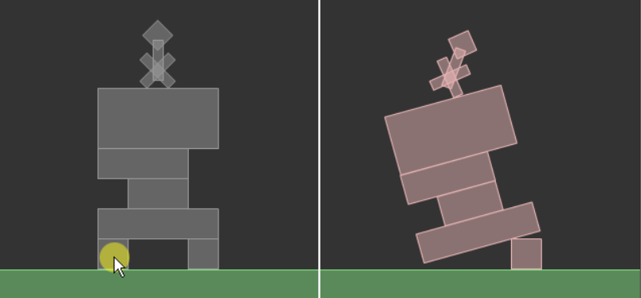
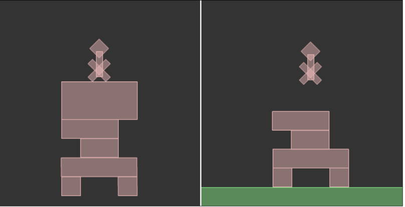

2D物理引擎 Box2D for javascript Games  第三章 刚体的交互

# 刚体的交互

基于Box2D的游戏都有各自的一套刚体交互方法。
图腾破坏者(Totem Destroyer)和红 砖移除(Red Remover)允许玩家通过鼠标点击来销毁刚体，然而愤怒的小鸟(Angry Birds)是通过拖拽使刚体(小鸟)飞行。
你已经知道怎样创建原始和复杂的刚体;
是时候来看看Box2D是怎样允许我们在世界中与刚体交互的。
在本章，你L将学习获u取Box2D的刚体信息进行交互的多种方式，包括:

- 通过鼠标选择刚体 

- 销毁刚体

- 对 刚体设置自定义属性

- 循环遍历世界中的所有刚体

- 获得刚体信息


通过本章的学习，你将有一个完全可玩的图腾破坏者关卡。我们与Box2D刚体最简单 并且最直观的交互方式是通过鼠标点击来销毁它们。

## 通过鼠标点击选择并销毁刚体

我们需要完成之前的图腾破坏者的关卡，所以这里将使用你在第二章，向世界添加
刚体中创建的脚本。你应该准备销毁顶部有神像的图腾。

1. Main() 方法中添加事件监听:
    ```
    document.querySelector('#canvas').addEventListener('click', destroyBrick)
    ```

    我不会去解释前面的这几行代码，因为它与Box2D无关并且你应该已经知 道怎样创建一个鼠标监听。

2. 事情变得越来越有趣了，在 destroyBrick() 方法中，它将被每一次鼠标点击调用:
    ```
    function destroyBrick(e){
      var px = e.pageX/worldScale;
      var py = e.pageY/worldScale;
      mousePVec = new b2Vec2(px/worldScale, py/worldScale);
      world.QueryPoint(queryCallback, new b2Vec2(px, py));
    }
    ```
    让我们来一行行的解释。首先前两行获取mouseX和mouseY的鼠标x和y位置的值，并依据 worldScale 变量，分别将它们的像素(pixels)转换为米 (meters)。这样变量pX和pY将存储我们刚刚点击的世界坐标(米)。
    现在，是时候来看看如果一个刚体在我们点击的点上。世界的QueryPoint()方 法查询世界中所有的夹具，找出在点上的夹具，然后如果有夹具在鼠标点击 的点上，于是我们可以说我们点击了一个夹具。
    让我们来看看QueryPoint()方法的参数;首先，是一个名字为 queryCallback 的回调函数，然后是一个作为b2Vec2对象的点坐标，它代表了转换的鼠标坐标。
3. queryCallback 方法是这个脚本的核心，它有一个参数，如果有的话，这个 参数是在鼠标点击的点上的夹具。因为一个点上可以有不止一个的夹具(试 想一下重叠的staitc类型的刚体)，如果你希望检查下一个夹具，那么你需要 让函数返回true，或者返回false将停止检查。

    目前，我们假设只可以有一个夹具在鼠标点击的点上，因此，我将如下这 样编写queryCallback()方法:

    ```
    function queryCallback(fixture){
      console.log(fixture)
    }
    ```

    此刻，我们只想要在输出窗口中输出一些一般的调试文本，所以，一旦
    你测试影片然后点击刚体，你将会看到下面的文本:
    ```
    b2Fixture{...}
    ```

    这意味着我们执行queryCallback()方法成功，然后我们可以确定用户点击 的夹具。

4. 不幸的是，只是知道夹具是不够的，因为我们需要知道我将要移除的刚体。你 可以使用GetBody()方法从夹具获得刚体，因此你可以将queryCallback()方法改 变成下面这样:

    ```
    function queryCallback(fixture){
      var touchedBody = fixture.GetBody();
      console.log(touchedBody)
    }
    ```
    
    如果你测试影片然后点击一个刚体，你将在输出窗口中看到下面的文本:

    ```
    b2Body{...}
    ```

    现在，我们知道了怎样获取玩家点击的刚体，是时候真正的开始销毁它 了。将一个刚体从世界中移除，使用世界的 DstroyBody() 方法然后你就能 打碎图腾了。

    ```
    function queryCallback(fixture){
      var touchedBody = fixture.GetBody();
      world.DestroyBody(touchedBody);
    }
    ```

6. 测试网页。点击砖块然后你就会看到砖块消失了，图腾被销毁了。
    

    源码在 `article/ch03/ch03-1.html`

总之，我们仍然有一个问题。在图腾破坏者中，不是所有的砖块都可以被销毁
的，但是目前如果你点击任何一个图腾砖块，你将销毁这个图腾砖块。
而且，你甚至可以销毁神像和地面。



看看之前的截图。左边的，我销毁了地面，这是错误的。右边，我销毁了最上面的
一块图腾砖块，原游戏关卡中，这块图腾是不可被销毁的。
这是个问题，我们需要找到一个办法，去告诉Box2D那一个刚体可以被销毁， 而且那一个刚体不可以被销毁。
幸运的是，Box2D的刚体定义很出色，我们甚至可以向刚体添加我们自定义的属性特征。


