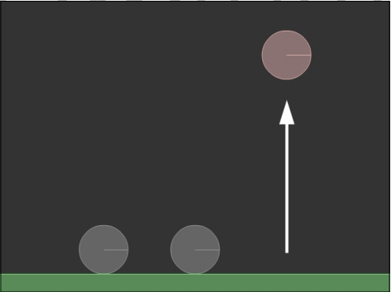

2D物理引擎 Box2D for javascript Games  第四章 将力作用到刚体上

# 将力作用到刚体上

Box2D 是一个在力作用下的世界，它可以将力作用于刚体上，从而给我们一个更加真实的模拟。

但是，如果你想要移动刚体，发射子弹，抛掷小鸟，驾驶汽车和当你在玩物理游戏时你看到的一切令人起劲的事情，那么你必须要手动的将力作用刚体上。

在本章，你将学习怎样通过不同的方法将力作用于刚体上使它移动，管理很多新的Box2D特征，包含如下：

- 将力作用到刚体上
- 将冲量作用到刚体上
- 设置刚体的线性速率
- 知道刚体的质量
- 根据你的游戏设置需要应用正确的力的作用方式
- 在你的游戏中使用物理和非物理资源

通过本章的学习，你将有能力创建愤怒的小鸟的一个关卡，包含小鸟的发射器。

## 苹果掉落，修正

传说牛顿发现重力是因为一个苹果掉下来砸到了他。你将学习用力将一些对象从地面提升起来。

我们将从三个 dynamic 类型的球体放置在一个 static 类型的地面上的脚本开始。

下面将是你开始的基础代码

```
function init() {
    var   b2Vec2 = Box2D.Common.Math.b2Vec2
    ,  b2AABB = Box2D.Collision.b2AABB
    ,	b2BodyDef = Box2D.Dynamics.b2BodyDef
    ,	b2Body = Box2D.Dynamics.b2Body
    ,	b2FixtureDef = Box2D.Dynamics.b2FixtureDef
    ,	b2Fixture = Box2D.Dynamics.b2Fixture
    ,	b2World = Box2D.Dynamics.b2World
    ,	b2MassData = Box2D.Collision.Shapes.b2MassData
    ,	b2PolygonShape = Box2D.Collision.Shapes.b2PolygonShape
    ,	b2CircleShape = Box2D.Collision.Shapes.b2CircleShape
    ,	b2DebugDraw = Box2D.Dynamics.b2DebugDraw
    ,  b2MouseJointDef =  Box2D.Dynamics.Joints.b2MouseJointDef
    ;

    var worldScale = 30; // box2d中以米为单位，1米=30像素
    var gravity = new b2Vec2(0, 10);
    var sleep = true;
    var world;
    var velIterations = 10;// 速率约束解算器
    var posIterations = 10;// 位置约束解算器
    var sphereVector;

    function main(){
    world = new b2World(gravity, sleep);
    debugDraw();
    floor();

    sphereVector = [];
    for(var i=0; i<3; i++){
        sphereVector.push(sphere(170+i*150, 410, 40));
    }

    setInterval(updateWorld, 1000 / 60);
    }
    main();


    function sphere(px, py, r){
    var bodyDef = new b2BodyDef();
    bodyDef.position.Set(px/worldScale, py/worldScale);
    bodyDef.type = b2Body.b2_dynamicBody
    bodyDef.userData = py;
    var circleShape = new b2CircleShape(r/worldScale);
    var fixtureDef = new b2FixtureDef();
    fixtureDef.shape = circleShape;
    fixtureDef.density = 2;
    fixtureDef.restitution = .4
    fixtureDef.friction = .5;
    var theSphere = world.CreateBody(bodyDef);
    theSphere.CreateFixture(fixtureDef);
    return theSphere;
    }

    function floor(){
    var bodyDef = new b2BodyDef();
    bodyDef.position.Set(320/worldScale, 465/worldScale);
    var polygonShape = new b2PolygonShape();
    polygonShape.SetAsBox(320/worldScale, 15/worldScale);
    var fixtureDef = new b2FixtureDef();
    fixtureDef.shape = polygonShape;
    fixtureDef.restitution = .4;
    fixtureDef.friction = .5;
    var theFloor = world.CreateBody(bodyDef);
    theFloor.CreateFixture(fixtureDef);
    }


    function updateWorld() {
    world.Step(1/30, 10, 10);// 更新世界模拟
    world.DrawDebugData(); // 显示刚体debug轮廓
    world.ClearForces(); // 清除作用力
    }

    //setup debug draw
    function debugDraw(){
    var debugDraw = new b2DebugDraw();
    debugDraw.SetSprite(document.getElementById("canvas").getContext("2d"));
    debugDraw.SetDrawScale(worldScale);
    debugDraw.SetFillAlpha(0.5);
    debugDraw.SetFlags(b2DebugDraw.e_shapeBit | b2DebugDraw.e_jointBit);
    world.SetDebugDraw(debugDraw);
    }
};
```

源码在： `article/ch04/ch04-1.html`


你应该很熟悉上面的代码了，它只是对之前章节的图腾脚本稍作修改而成的。

虽然向 sphere()方法传入以像素为单位的中心坐标和半径后，会创建一个 dynamic 类型的球体，但是 updateWorld、floor、debugDraw 和之前是一样没变

测试网页，你会发现三个球体依次摆地面上


每一个球体都存储在 sphereVector 中，从左到右分别是：sphereVector[0]，sphereVector[1]，sphereVector[2]。        

我们开始让球体弹跳吧。在这个示例中有三个 dynamic 类型的刚体，因为它们将用来让你学习三种不同的方式将力作用于刚体上，每一种都有优点和缺点。

## 力，冲量和线速率

让我们直接来看看Main()方法中新加的这几行代码：

```
function main(){
    world = new b2World(gravity, sleep);
    debugDraw();
    floor();

    sphereVector = [];
    for(var i=0; i<3; i++){
        sphereVector.push(sphere(170+i*150, 410, 40));
    }

    var force = new b2Vec2(0,-15);
    var sphereCenter = sphereVector[0].GetWorldCenter(); 
    sphereVector[0].ApplyForce(force, sphereCenter);
    sphereCenter = sphereVector[1].GetWorldCenter();
    sphereVector[1].ApplyImpulse(force,sphereCenter);
    sphereVector[2].SetLinearVelocity(force);

    setInterval(updateWorld, 1000 / 60);
}
```

这是本章的核心，并且有着很多新的知识，所以让我们，一行行的来解释它们：

```
var force = new b2Vec2(0,-15);
```

首先，我们需要创建一个 b2Vec2 类型的变量，它将代表我们想要作用到所有球体上的力。设置为（0,-15），意味着这是一个垂直方向的力，它将是球体跳跃起来。

光有一个力是不够的，我们还需要一个应用力的作用点。在本例中，我们想将力的作用在每个球体的质心。

```
var sphereCenter = sphereVector[0].GetWorldCenter();
```

我们可以使用 b2Body 的 GetWorldCenter() 方法，来确定刚体质心。它将返回一个 b2Vec2 对象的质心。

在这里，shpereCenter 变量将包含左边球体的质心。

```
sphereVector[0].ApplyForce(force,sphereCenter);
```

之前的那些代码展示了第一种将力作用到刚体上的方法。

ApplyForce() 方法将力作用到一点上，通常使用的牛顿（N）为单位。如果力没有作用在质心，它将产生一个扭矩并影响角速度，这就是为什么我们想要获得质心的原因。

如果刚体在睡眠状态，ApplyForce() 将可以唤醒它们。

```
sphereCenter=sphereVector[1].GetWorldCenter();
```

当我们完成来了将力作用的左边的球体时，那么让我们将逐一集中到中间的球体上。

我们将像之前一样获取质心，然后添加另一种作用力的方法。

```
sphereVector[1].ApplyImpulse(force,sphereCenter);
```

ApplyImpulse() 方法将一个冲量作用到一个点上，通常使用牛顿每秒（n/s），将会立刻改变刚体的速率。

如果冲量的作用点不是质心的话，那么它将会改变角速度，但是在本例中没有出现，ApplyImpulse() 方法也将唤醒在睡眠状态的刚体。

现在我们完成了对中间的球体作用力，让我们来看看右边的球体：

```
sphereVector[2].SetLinearVelocity(force);
```

SetLinearVelocity 方法设置质心的线速度。

它不像 ApplyForce() 和 ApplyImpulse() 方法那样需要第二个参数，因为它一直是作用在质心的。

你是否对球体将怎样反应力的作用而刚到疑惑？

那么我们添加一些代码来看看球体做了些什么吧。

首先我们在 sphere() 方法中将球体的垂直坐标存储到 userData 属性中：

```
function sphere(px, py, r){
    var bodyDef = new b2BodyDef();
    bodyDef.position.Set(px/worldScale, py/worldScale);
    bodyDef.type = b2Body.b2_dynamicBody
    bodyDef.userData = py;
    var circleShape = new b2CircleShape(r/worldScale);
    var fixtureDef = new b2FixtureDef();
    fixtureDef.shape = circleShape;
    fixtureDef.density = 2;
    fixtureDef.restitution = .4
    fixtureDef.friction = .5;
    var theSphere = world.CreateBody(bodyDef);
    theSphere.CreateFixture(fixtureDef);
    return theSphere;
}
```

这里没有什么新的知识，因此我们将不再赘述 userData 属性的作用。

现在，我们将在输出窗口输出一些文本，向下面这样改变 updateWorld() 方法：

```
function updateWorld() {
    var maxHeight;
    var currHeight;
    var outHeight;
    world.Step(1/30,10,10);
    for (var i = 0; i<3; i++) {
        maxHeight=sphereVector[i].GetUserData();
        currHeight=sphereVector[i].GetPosition().y*worldScale;    
        maxHeight=Math.min(maxHeight,currHeight);
        sphereVector[i].SetUserData(maxHeight);
        outHeight=sphereVector[i].GetUserData();
        console.log("Sphere "+i+":"+Math.round(outHeight));
    }
    world.DrawDebugData(); // 显示刚体debug轮廓
    world.ClearForces(); // 清除作用力
}
```

我想保持跟踪每个球体达到的最大高度，所以我们将看看每一个球体的坐标最小值（y轴是从上向下递增），以像素为单位。

我们看到只是将 userData 属性中存储 userData 和当前跟踪坐标的最小值，它代表了球体达到的最大高度，然后将结果输出到控制台。

测试影片，你将看到最右边的球体弹跳的最高，然而剩下的球体看起来几乎静止在地面上



源码在： `article/ch04/ch04-2.html`

同时，我们来看看输出窗口中证实我们在影片中看到的球体的弹跳高度的文本。

最右边的文本达到了80像素，上升高度为330像素，中间的球体只弹跳了2像素，最左边的球体没有弹跳。

* Sphere 0:410 
* Sphere 1:408 
* Sphere 2:80

我们可能会认为响应力作用的球体太重（但是最右边的球体弹跳的却很高），所以我们在 sphere()方 法中将它们的密度从 2 减低到 1：

```
function sphere(px, py, r){
    var bodyDef = new b2BodyDef();
    bodyDef.position.Set(px/worldScale, py/worldScale);
    bodyDef.type = b2Body.b2_dynamicBody
    bodyDef.userData = py;
    var circleShape = new b2CircleShape(r/worldScale);
    var fixtureDef = new b2FixtureDef();
    fixtureDef.shape = circleShape;
    fixtureDef.density = 1;
    fixtureDef.restitution = .4
    fixtureDef.friction = .5;
    var theSphere = world.CreateBody(bodyDef);
    theSphere.CreateFixture(fixtureDef);
    return theSphere;
}
```

让我们再次测试网页并看看发生了什么：

* Sphere 0:410 
* Sphere 1:401 
* Sphere 2:80

第一件事你应该注意到了，最右边的球体达到的高度和之前一样，和密度的改变没有关系。

这是因为 SetLinearVelocity() 方法只设置刚体的线速度，与刚体的质量和之前的速度无关。它只设置速度，就是这样！

另一方面，中间的球体比之前弹跳的高度多了一点，所以这意味着ApplyImpulse()方法依赖于刚体的质量。

源码在： `article/ch04/ch04-3.html`

## 应用冲量来得到线速度

现在，给两个睡眠的球体相同的质量和作用力

SetLinearVelocity() 方法设置速度和质量无关，

而 ApplyImpulse()方法则受质量的影响，

如果我们将 ApplyImpulse() 方法中的力设置为 SetLinearVelocity() 方法中力的质量倍数（将SetLinearVelocity()方法设置的力乘以刚体质量），

向下面这样改动 main() 方法：

```
function main(){
    world = new b2World(gravity, sleep);
    debugDraw();
    floor();

    sphereVector = [];
    for(var i=0; i<3; i++){
        sphereVector.push(sphere(170+i*150, 410, 40));
    }

    var force = new b2Vec2(0 ,-15);
    var forceByMass = force.Copy();
    forceByMass.Multiply(sphereVector[1].GetMass());
    var sphereCenter = sphereVector[0].GetWorldCenter();
    sphereVector[0].ApplyForce(force,sphereCenter);
    sphereCenter = sphereVector[1].GetWorldCenter();
    sphereVector[1].ApplyImpulse(forceByMass, sphereCenter);
    sphereVector[2].SetLinearVelocity(force);

    setInterval(updateWorld, 1000 / 60);
    }
    main();
```


这里有几个新概念。

首先，看看 Copy() 方法，它是用来拷贝一份 b2Vec2 对象，为了避免原来的矢量通过引用被修改。

然后，Mutiply() 方法将 b2Vec2 值乘以一个给定的数值，在本例中，这个数值是球体的质量。

b2Body 的 GetMass() 方法将返回刚体的质量单位为千克。

最后，我们定义一个新的力，变量名为 forceByMass，我们将它作用到中间的球体上。

测试网页，你将看到中间和右边的球体弹跳到相同的高度：


源码在： `article/ch04/ch04-4.html`

控制台输出的文本如下：

- Sphere 0:410
- Sphere 1:80
- Sphere 2:80

中间和右边的球体都以相同的方式响应力的作用了，然而 左边的球体仍然停留在原先的位置。

到底出了什么问题呢？

这与时间相关，一个冲量作用的时间是一瞬间，一个力作用时间是持续的，然而通常处理物理问题的计量单位是秒。

这意味着我们想要左边的球体像其它两个球一样做出反应，我们应该将中间球体的力乘以模拟一秒所需要的时间步。

## 应用力来获得线速度

因为 Step() 方法的工作周期是 1/30 秒，我们需要将力乘以 30，所以我们向下面这样改变 main() 方法：

```
function main(){
    world = new b2World(gravity, sleep);
    debugDraw();
    floor();

    sphereVector = [];
    for(var i=0; i<3; i++){
        sphereVector.push(sphere(170+i*150, 410, 40));
    }

    var force = new b2Vec2(0, -15);
    var forceByMass = force.Copy();
    forceByMass.Multiply(sphereVector[1].GetMass());
    var forceByMassByTime = forceByMass.Copy();
    forceByMassByTime.Multiply(30);
    var sphereCenter = sphereVector[0].GetWorldCenter();
    sphereVector[0].ApplyForce(forceByMassByTime, sphereCenter);
    sphereCenter = sphereVector[1].GetWorldCenter();
    sphereVector[1].ApplyImpulse(forceByMass, sphereCenter);
    sphereVector[2].SetLinearVelocity(force);

    setInterval(updateWorld, 1000 / 60);
}
main();
```
这里的概念和之前我们创建新的力和应用力到最左边的球体时一样。我将中间球体的力乘以 30。

测试网页，现在所有的球体将会有着相同的反应：


源码在： `article/ch04/ch04-5.html`


同时，输出窗口中输出的文本证实了我们通过三种不同的方式控制三个相同的球体获得了相同的效果：

- Sphere 0:80
- Sphere 1:80
- Sphere 2:80

到目前为止，你学习了将力应用到刚体上的基础知识。

总之，这个过程很简单，因为你只是将力作用的睡眠状态的刚体上。

为了在移动的或与其它刚体发生碰撞的刚体上实现相同效果将会困难的多。

虽然你可以选择你喜欢的方式将力作用到刚体上，但是，下面关于根据游戏开发的需要选择使用力的方式的建议是很有用的：

- 当你想要停止一个刚体（无论它处于什么状态，碰撞或移动）并让它开始一个新的状态时，我们使用线速度（LinearVelocity）来设置。
  
  在游戏设计中，试想一下一个移动的平台或一个敌人的巡逻区域：在每个时间步中，你可以设置它的线速度然后它将直接向另一个方向移动。

- 当你想在单个时间步中应用所有力到已有力作用的刚体上时，使用冲量（Impulse）来设置。在游戏设计中，将使用冲量使角色跳动。
  
- 当你想要给你的角色在一定时间内作用一个推力时，使用力（Force）来设置。例如：一个喷气火箭背包。

但是，最重要的是尝试！相同的事情可以使用不同的方法，这取决你找到一种适合你的作用力的方式。


## 将力应用到真实的游戏中

现在，让我将力应用到愤怒的小鸟的世界中吧！


上图是愤怒的小鸟浏览器版的第一个关卡，这也是我们将要模仿创建的关卡。

目前，搭建愤怒的小鸟的关卡与搭建图腾破坏者关卡并没有什么不同，正如你所看到的，我重复使用了在之前章节中已解释过的大部分方法。

所以，main 函数将如下所示：

```
<script> 
function init() {
    var   b2Vec2 = Box2D.Common.Math.b2Vec2
        ,  b2AABB = Box2D.Collision.b2AABB
        ,	b2BodyDef = Box2D.Dynamics.b2BodyDef
        ,	b2Body = Box2D.Dynamics.b2Body
        ,	b2FixtureDef = Box2D.Dynamics.b2FixtureDef
        ,	b2Fixture = Box2D.Dynamics.b2Fixture
        ,	b2World = Box2D.Dynamics.b2World
        ,	b2MassData = Box2D.Collision.Shapes.b2MassData
        ,	b2PolygonShape = Box2D.Collision.Shapes.b2PolygonShape
        ,	b2CircleShape = Box2D.Collision.Shapes.b2CircleShape
        ,	b2DebugDraw = Box2D.Dynamics.b2DebugDraw
        ,  b2MouseJointDef =  Box2D.Dynamics.Joints.b2MouseJointDef
        ;

        var worldScale = 30; // box2d中以米为单位，1米=30像素
        var gravity = new b2Vec2(0, 5);
        var sleep = true;
        var world;
        function main(){
        world = new b2World(gravity, sleep);
        debugDraw();
        floor();

        brick(402,431,140,36);
        brick(544,431,140,36);
        brick(342,396,16,32);
        brick(604,396,16,32);

        brick(416,347,16,130);
        brick(532,347,16,130);
        brick(474,273,132,16);
        brick(474,257,32,16);

        brick(445,199,16,130);
        brick(503,199,16,130);
        brick(474,125,58,16);
        brick(474,100,32,32);
        brick(474,67,16,32);

        brick(474,404,64,16);
        brick(450,363,16,64);
        brick(498,363,16,64);
        brick(474,322,64,16);

        setInterval(updateWorld, 1000 / 60);
    }
    main();
    

    function brick(px, py, w, h, s){
        var bodyDef = new b2BodyDef();
        bodyDef.position.Set(px/worldScale, py/worldScale);
        bodyDef.type = b2Body.b2_dynamicBody;
        bodyDef.userData = s;
        var polygonShape = new b2PolygonShape();
        polygonShape.SetAsBox(w/2/worldScale, h/2/worldScale);
        var fixtureDef = new b2FixtureDef();
        fixtureDef.shape = polygonShape;
        fixtureDef.density = 2;
        fixtureDef.restitution = .4;
        fixtureDef.friction = .5;
        var theBrick = world.CreateBody(bodyDef);
        theBrick.CreateFixture(fixtureDef);
    }

    function sphere(px, py, r){
        var bodyDef = new b2BodyDef();
        bodyDef.position.Set(px/worldScale, py/worldScale);
        bodyDef.type = b2Body.b2_dynamicBody
        bodyDef.userData = py;
        var circleShape = new b2CircleShape(r/worldScale);
        var fixtureDef = new b2FixtureDef();
        fixtureDef.shape = circleShape;
        fixtureDef.density = 1;
        fixtureDef.restitution = .4
        fixtureDef.friction = .5;
        var theSphere = world.CreateBody(bodyDef);
        theSphere.CreateFixture(fixtureDef);
        return theSphere;
    }

    function floor(){
        var bodyDef = new b2BodyDef();
        bodyDef.position.Set(320/worldScale, 465/worldScale);
        var polygonShape = new b2PolygonShape();
        polygonShape.SetAsBox(320/worldScale, 15/worldScale);
        var fixtureDef = new b2FixtureDef();
        fixtureDef.shape = polygonShape;
        fixtureDef.restitution = .4;
        fixtureDef.friction = .5;
        var theFloor = world.CreateBody(bodyDef);
        theFloor.CreateFixture(fixtureDef);
    }

    
    function updateWorld() {
        world.Step(1/30, 10, 10);// 更新世界模拟
        world.DrawDebugData(); // 显示刚体debug轮廓
        world.ClearForces(); // 清除作用力
    }

    //setup debug draw
    function debugDraw(){
        var debugDraw = new b2DebugDraw();
        debugDraw.SetSprite(document.getElementById("canvas").getContext("2d"));
        debugDraw.SetDrawScale(worldScale);
        debugDraw.SetFillAlpha(0.5);
        debugDraw.SetFlags(b2DebugDraw.e_shapeBit | b2DebugDraw.e_jointBit);
        world.SetDebugDraw(debugDraw);
    }
};
</script>
```

上面的代码只是单纯的复制/粘贴之前的脚本，所以在这里没有什么

要解释。测试网页，你应该看到你所搭建的关卡：


源码在： `article/ch04/ch04-6.html`


我们搭建的关卡中并没有创建小猪，因为现在你还没有能力去消灭它，所以它与目前的学习没有关系，我们将在下一个章节再提到它。

此刻，我们只要摧毁它的房子有就可以了。

在我们粉碎小猪们的藏身之处之前，我们需要绘制出一些代表橡皮弹弓和小鸟的图形。

橡皮弹弓主要是一个让小鸟可以在其内部移动的圆圈。

此刻，我们将使用另一个圆来代表小鸟。


## 物理游戏不只是关于物理

因为这部分内容是为了实现让玩家发射小鸟的功能，与 Box2D 无关。

所以，我会很快的讲解这些知识，那么我们开始吧！

在开始绘图之前，我想让你知道，你可以在你的游戏中混合使用物理和非物理的脚本，就像我现在要做的一样。

在本例中，玩家的交互不是由 Box2D 管理，它只有在小鸟被释放的时候才会被使用。


我在这里引入了 createjs 用于绘制图形与交互

我在 番外篇 里介绍过了，如果你还不了解，那么需要回顾一下 源码在 `extra.html`

首先，我们需要一些变量：

```
var theBird = new createjs.Shape();
var slingX = 100;
var slingY = 250;
var slingR = 75;
```

theBird 代表了可拖拽的小鸟，slingX 和 slingY 是橡皮弹弓的中心，以像素为单位，然后

slingR 是橡皮弹弓可拖拽区域的半径，以像素为单位。

现在，我们需要在舞台上绘制一些东西。我们将绘制一个大圆圈代表橡皮弹弓的可拖拽区域，然后小的圆圈代表小鸟。

同时，我们将添加一些监听，去选择，拖拽以及释放小鸟。

将下面的代码添加到 main 方法中：

```
function main(){
    world = new b2World(gravity, sleep);
    debugDraw();
    floor();

    brick(402,431,140,36);
    brick(544,431,140,36);
    brick(342,396,16,32);
    brick(604,396,16,32);

    brick(416,347,16,130);
    brick(532,347,16,130);
    brick(474,273,132,16);
    brick(474,257,32,16);

    brick(445,199,16,130);
    brick(503,199,16,130);
    brick(474,125,58,16);
    brick(474,100,32,32);
    brick(474,67,16,32);

    brick(474,404,64,16);
    brick(450,363,16,64);
    brick(498,363,16,64);
    brick(474,322,64,16);

    // 画出大圆
    var slingCanvas = new createjs.Shape();
    slingCanvas.graphics.setStrokeStyle(1, "round").beginStroke("white");
    slingCanvas.graphics.drawCircle(0, 0, slingR);
    stage.addChild(slingCanvas);
    slingCanvas.x = slingX;
    slingCanvas.y = slingY;
    
    // 画出小鸟
    theBird.graphics.setStrokeStyle(1, "round").beginStroke("white");
    theBird.graphics.beginFill('white').drawCircle(0,0,15);
    stage.addChild(theBird);
    theBird.x = slingX;
    theBird.y = slingY;

    // 拖动小鸟
    theBird.on("pressmove", birdMove);
    theBird.on("pressup", birdRelease)

    createjs.Ticker.timingMode = createjs.Ticker.RAF;
    createjs.Ticker.on("tick", function(){
        stage.update();// 这是 CreateJS 舞台更新所需要的

        world.DrawDebugData(); // 为了显示出createjs对象，这里不再绘制box2d对象至canvas
        world.Step(1/30, 10, 10);// 更新世界模拟
        world.ClearForces(); // 清除作用力
    });
    }
    main();
```
> 注意，由于要结合 2d 图形库，原 updateWorld 方法迁到了  createjs.Ticker.on("tick", ()=>{...}) 内

我们只是绘制了一些东西，所以没有什么需要说明的。现在，当玩家在小鸟上按下

鼠标时，我们需要一个方法来执行它 birdMove

```
function  birdMove(e){
    const mouseX = e.stageX;
    const mouseY = e.stageY;
    theBird.x = mouseX;
    theBird.y = mouseY;
    var distanceX = theBird.x-slingX;
    var distanceY = theBird.y-slingY;
    if (distanceX*distanceX+distanceY*distanceY>slingR*slingR) {
        var birdAngle = Math.atan2(distanceY,distanceX);
        theBird.x=slingX+slingR*Math.cos(birdAngle);
        theBird.y=slingY+slingR*Math.sin(birdAngle);
    }
}
```

只要玩家按压鼠标按钮并移动，birdMove() 方法将被调用，然后将在橡皮弹弓的区域内移动小鸟

> 注意，我们没有在舞台上使用 Box2D。因为用小鸟来瞄准不涉及物理，所以无需使用它，并且有一个黄金原则：在需要时，才使用物理引擎。

只有一件事情与我们的物理世界有关，那就是玩家释放小鸟时的位置。

根据小鸟的位置和橡皮弹弓的中心，我们可以决定怎样发射小鸟。

因此，birdRelease() 方法在此刻将只是在输出窗口输出释放小鸟的坐标：

```
function birdRelease(e){
    console.log(`bird released at ${e.target.x}, ${e.target.y}`)
}
```

测试网页，你将能够在橡皮弹弓的区域内移动你的小鸟。


源码在： `article/ch04/ch04-7.html`

一旦你释放小鸟，你将看到在输出窗口有一些释放坐标的文本。

在前面的截图中，一个小鸟被释放，它的位置将在控制台被输出：

```
bird released at 44,274
```
这是我们发射物理小鸟所需要的一切。

## 放置小鸟

在这里，Box2D 将要起到它的作用。

正如我们近似的将小鸟看作圆形，那么我们需要在玩家释放鼠标的相同位置创建一个 Box2D 圆形。

向下面这样改变 birdRelease() 方法：

```
function birdRelease(e){
    var sphereX = theBird.x/worldScale;
    var sphereY = theBird.y/worldScale;
    var r = 15 / worldScale;
    var bodyDef = new b2BodyDef();
    bodyDef.position.Set(sphereX,sphereY);
    var circleShape  = new b2CircleShape(r);  
    var fixtureDef = new b2FixtureDef();
    fixtureDef.shape=circleShape;
    fixtureDef.density = 4;
    fixtureDef.restitution = 0.4;
    fixtureDef.friction = 0.5;
    var physicsBird = world.CreateBody(bodyDef);
    physicsBird.CreateFixture(fixtureDef);
    stage.removeChild(theBird);
}
```

这里没有什么新的知识，我们只要创建一个和小鸟坐标和尺寸相同的 static 类型的圆形即可。

测试网页，通过拖拽和释放圆圈。它将会转变为一个 static 类型的 Box2D 圆形刚体。


源码在： `article/ch04/ch04-8.html`

现在，我们终于可以应用力并运行模拟。

## 发射物理小鸟

我们需要在 birdRelease() 方法中添加一些代码：

```
function birdRelease(e){
    var distanceX = theBird.x-slingX;
    var distanceY = theBird.y-slingY;
    var velocityX = distanceX*-1/5;
    var velocityY = distanceY*-1/5;
    var birdVelocity = new b2Vec2(velocityX,velocityY);

    var sphereX = theBird.x/worldScale;
    var sphereY = theBird.y/worldScale;
    var r = 15 / worldScale;
    var bodyDef = new b2BodyDef();
    bodyDef.position.Set(sphereX,sphereY);

    bodyDef.type = b2Body.b2_dynamicBody;

    var circleShape  = new b2CircleShape(r);  
    var fixtureDef = new b2FixtureDef();
    fixtureDef.shape=circleShape;
    fixtureDef.density = 4;
    fixtureDef.restitution = 0.4;
    fixtureDef.friction = 0.5;
    var physicsBird = world.CreateBody(bodyDef);

    physicsBird.SetLinearVelocity(birdVelocity);

    physicsBird.CreateFixture(fixtureDef);
    stage.removeChild(theBird);
}
```

最后，我们添加了一些力，所以是时候来解释一下这些代码：

```
var distanceX = theBird.x-slingX;
var distanceY = theBird.y-slingY;
```

distanceX 和 distanceY 这两个数值代表了小鸟和橡皮弹弓中心之间的距离。

距离越大，则作用的力将越大。

```
var velocityX = distanceX*-1/5;
var velocityY = distanceY*-1/5;
```

我们之前说过力与距离有关，所以上面的代码将计算水平和垂直的速度。

首先，我们将水平或垂直距离乘以 -1，因为力与距离的方向相反，否则小鸟将被发射到错误的方向。

然后，我们再将之前的乘积除以 5，只是为了让小鸟发射的速度减弱一些，否则我们将发射一只超音速小鸟。

改变这个值将影响游戏的设置，所以需要看效果来一点点调整：

```
var birdVelocity = new b2Vec2(velocityX,velocityY);
```

最后，velocity（X/Y）变量被用来创建 b2Vec2 对象，将分配力道小鸟上。

```
bodyDef.type=b2Body.b2_dynamicBody;
```

很显然，在我们将力作用到刚体上之前，我们必须将刚体设置为 dynamic 类型。

```
physicsBird.SetLinearVelocity(birdVelocity);
```

现在，小鸟可以起飞然后摧毁小猪的老巢了。

我使用 SetLinearVelocity() 方法将力作用到小鸟上

是因为我想让在同一点发射的所有类型的小鸟获得相同的速度，而与它们的尺寸和质量无关。

显然，我可以通过像本章节开始时所展示的那样，对 birdVelocity 进行乘法运算来使用 ApplyForce() 和 ApplyImpulse() 方法

但是，何必要自寻烦恼呢？我们的 SetLinearVelocity() 方法可以很好的胜任这个任务了，不是吗？

测试网页，通过拖拽然后释放小鸟，你将能够摧毁下面的场景。


源码在： `article/ch04/ch04-9.html`

如前所说，这便是你的愤怒的小鸟的关卡。虽然没有小猪和跟踪小鸟的摄像机，但是你将在下面的章节学习怎样去实现它们。

## 小结

在本章，你学习了怎样在你的 Box2D世界中使用力移动刚体。

通过应用力，可以实现很多事情。

从一个模型到一个撞击游戏，每一个物理游戏中玩家移动刚体都是通过一些方式来使用力实现的

那么现在，你知道了怎样应用它们。

----
本文相关代码请在

https://github.com/willian12345/Box2D-for-Javascript-Games


注：转载请注明出处博客园：王二狗Sheldon池中物 (willian12345@126.com)