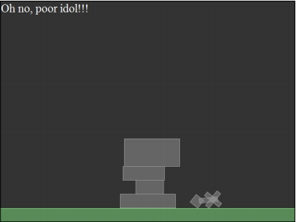
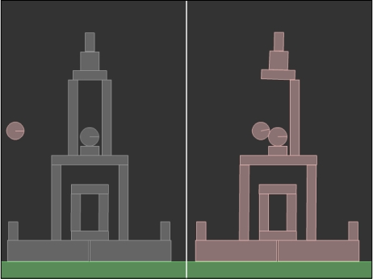

2D物理引擎 Box2D for javascript Games  第五章 碰撞处理

# 碰撞处理

考虑到 Box2D 世界和在世界中移动的刚体之间迟早会发生碰撞。

而物理游戏的大多数功能则依赖于碰撞。在愤怒的小鸟中，小鸟摧毁小猪的城堡时，便是依赖碰撞而实现的；

在图腾破坏者中，当神像坠落到图腾上或摔碎在地面上，这是由于碰撞而实现的。

Box2D 已经为我们完成了所有用来解决碰撞的任务，并在无需我们编写代码的前提下运行模拟。

另外，在有些情况下，出于游戏设置的目的我们需要与碰撞进行交互

试想一下愤怒的小鸟，猛烈的撞击一块木质的围墙将可以摧毁它，但是通常 Box2D 碰撞按惯例是不会处理木质围墙的摧毁工作的。

此外，如果图腾破坏者中的神像撞击地面，该关卡将会失败，但是同样 Box2D 只是管理碰撞，而不会去在意游戏设置的规则。

这就是为什么我们有时需要分析碰撞，并且很幸运，Box2D 允许我们实现这个功能，这要感谢接触（contacts）：一个通过Box2D创建的对象，用来管理两个夹具间的碰撞。

在本章，你将学习怎样使用接触（contacts）来处理碰撞，以及其它的一些知识：

- 创建自定义的接触（contacts）监听
- 确定哪些刚体发生碰撞
- 确定碰撞的强度
- 遍历所有碰撞涉及的刚体
  
通过本章的学习，你将能够管理任何类型的碰撞，而且通过管理游戏中的碰撞还将完成愤怒的小鸟和图腾破坏者的关卡。

## 碰撞检测

碰撞管理的第一步是：知道两个刚体之间什么时候发生碰撞以及什么时候不在发生碰撞。

你是否还记的你在第二章，向世界添加刚体中创建的项目，小球在地面弹跳？

我们将再次使用这个项目来获得尽可能多的关于小球和地面之间碰撞的信息。

1. 向 main()方法中添加三行简单的代码，如下所示：
   
    ```
    function main(){
        var worldScale = 30; // box2d中以米为单位，1米=30像素
        var gravity = new b2Vec2(0, 9.81);
        var sleep = true;
        var world = new b2World(gravity, sleep);
        var velIterations = 10;// 速率约束解算器
        var posIterations = 10;// 位置约束解算器

        var bodyDef = new b2BodyDef();
        var fixtureDef = new b2FixtureDef();

        world.SetContactListener(new CustomContactListener());
        
        bodyDef.position.Set(320/worldScale, 30/ worldScale);
        
        bodyDef.type = b2Body.b2_dynamicBody;
        bodyDef.userData="Ball";
        var circleShape = new b2CircleShape(25/worldScale);
        fixtureDef.shape = circleShape;
        fixtureDef.density = 1;
        fixtureDef.restitution = .6;
        fixtureDef.friction = .1;
        var theBall = world.CreateBody(bodyDef);
        theBall.CreateFixture(fixtureDef);

        // 定义矩形地面
        bodyDef.position.Set(320/worldScale, 470/worldScale); // 复用定义刚体
        bodyDef.type = b2Body.b2_staticBody;
        bodyDef.userData="Floor";
        var polygonShape = new b2PolygonShape();
        polygonShape.SetAsBox(320/worldScale, 10/worldScale);
        fixtureDef.shape = polygonShape; // 复用夹具

        var theFloor = world.CreateBody(bodyDef);
        theFloor.CreateFixture(fixtureDef);


        function updateWorld() {
        world.Step(1/30, 10, 10);// 更新世界模拟
        world.DrawDebugData(); // 显示刚体debug轮廓
        world.ClearForces(); // 清除作用力
        }

        setInterval(updateWorld, 1000 / 60);

        //setup debug draw
        var debugDraw = new b2DebugDraw();
        debugDraw.SetSprite(document.getElementById("canvas").getContext("2d"));
        debugDraw.SetDrawScale(worldScale);
        debugDraw.SetFillAlpha(0.5);
        debugDraw.SetFlags(b2DebugDraw.e_shapeBit | b2DebugDraw.e_jointBit);
        world.SetDebugDraw(debugDraw);

        
        //update
        
        function update() {         
            world.Step(1 / 60, 10, 10);
            world.DrawDebugData();
            world.ClearForces();
        };
    }
    ```
2. 你已经知道怎样使用userData属性了，所以方法以及整个章节的核心在于下面这行代码：
   
   ```
   world.SetContactListener(new CustomContactListener());
   ```
   
   Box2D 允许我们创建一个支持我们管理碰撞所需的所有的事件的自定义接触（contacts）监听，例如当一个碰撞开始和结束，你可以使用与在 javascript 项目中处理鼠标或键盘事件相同的方式来处理它们。

源码在： `article/ch05/ch05-1.html`   

## Box2D 内建的碰撞监听

不需要太多的 Box2D 资源类，你应该知道它不但通过自身解决碰撞，而且还提供了四个有趣的监听，它们允许你可以与碰撞交互，检索信息或者甚至修改一些参数。

所有事情将在一个 `CustomContactListener` 类中来管理，这要归功于 SetContactListener() 方法，它允许我们创建自定义的接触回调。

```
class CustomContactListener extends b2ContactListener {
    BeginContact(contact) {
    console.log("a collision started");
    var fixtureA = contact.GetFixtureA();
    var fixtureB = contact.GetFixtureB();
    var bodyA = fixtureA.GetBody();
    var bodyB = fixtureB.GetBody();
    console.log("first body: "+bodyA.GetUserData());
    console.log("second body: "+bodyB.GetUserData());
    console.log("---------------------------");
    }

    EndContact(contact) {
    var fixtureA =contact.GetFixtureA();
    var fixtureB =contact.GetFixtureB();
    var bodyA = fixtureA.GetBody();
    var bodyB = fixtureB.GetBody();
    console.log("first body: "+bodyA.GetUserData());
    console.log("second body: "+bodyB.GetUserData());
    console.log("---------------------------");
    }
}
```

`CustomContactListener` 类的目的是为了覆盖 Box2D 的 BeginContact() 和 EndContact() 方法，默认的方法什么也做不了，我们通过他们获得关于碰撞的信息。


## 将碰撞开始和结束输出到输出窗口

顾名思义，BeginContact 事件是当两个夹具重叠时被调用，那么EndContact事件是当两个夹具不再重叠时被调用。

1. 让我们来一行行的分析BeginContact()方法的代码：
   
   ```
   var fixtureA:b2Fixture=contact.GetFixtureA();
    var fixtureB:b2Fixture=contact.GetFixtureB();
   ```

   如你所见，BeginContact()方法有一个b2Contact对象作为参数传入。
   
   它包含了我们此刻需要的所有碰撞信息。GetFixtureA() 和 GetFixtureB() 方法将返回碰撞所涉及的夹具。我将它们保存在fixtureA和fixtureB变量中

2. 然后，因为我需要的是刚体，我需要从夹具来获得刚体。你应该已经知 道关于 GetBody() 方法了：
   
   ```
   var bodyA:b2Body=fixtureA.GetBody();
   var bodyB:b2Body=fixtureB.GetBody();
   ```

3. bodyA 和bodyB 是发生碰撞的两个刚体。我将在输出窗口输出一些文本：
   
   ```
   console.log("first body: "+bodyA.GetUserData());
   console.log("second body: "+bodyB.GetUserData());
   ```
   我将它们的 userData 输出到输出窗口，它们是 Floor 和 Ball。

   BeginContact 方法和 BeginContact() 方法的代码一样，所以不需要再解释它，EndContact() 方法的代码。

4. 测试网页，然后每一次小球在地面弹起，你应该在控制台看到下面输出的文本：
   
   ```
   a collision started
  
    second body: Ball
    ---------------------------
    a collision ended
    
    second body: Ball
    ---------------------------
    ```
    真棒！因为现在只要刚体发生碰撞，你就知道了碰撞开始和结束的准确时间。

    但是，Box2D 接触（contact）监听还给了我们另外的两个回调方法，分别是 PreSolve(）和 PostSolve()方法。

## 检测当你要解决碰撞和当你解决了碰撞

PreSole 事件是在碰撞检测之后，碰撞决算之前的期间被调用，所以你可以在碰撞决算之前与它进行交互。

Post-Solve 事件是当碰撞决算之后发生，它可以使我们知道碰撞的冲量

1.  将下面的两个方法添加到 CustomContactListener 类中 

    ```
    PreSolve(contact , oldManifold ) {
        if (contact.GetManifold().m_pointCount>0) {
            console.log("a collision has been pre solved");
            var fixtureA = contact.GetFixtureA();
            var fixtureB = contact.GetFixtureB();
            var bodyA = fixtureA.GetBody();
            var bodyB = fixtureB.GetBody();
            console.log("first body: "+bodyA.GetUserData());
            console.log("second body: "+bodyB.GetUserData());
            console.log("---------------------------");
        }
    }
    ```
    
2. 目前，PreSolve 方法与 BeginContact() 和 EndContact() 方法有着相同的代码，
   
   但是这些代码只有在下面的 if 语句为 true 时才会执行：

   ```
   if (contact.GetManifold().m_pointCount>0) {}
   ```

   Box2d 将触点（contact point）集合到一个 manifold 结构中，PreSolve() 方法有时会在 manifold 中没有触点的情况下被调用，而这时我们想在至少有一个触点的情况下执行它。

3. PostSolve
   
   ```
   PostSolve(contact, impulse) {
        console.log("a collision has been post solved");
        var fixtureA = contact.GetFixtureA();
        var fixtureB = contact.GetFixtureB();
        var bodyA = fixtureA.GetBody();
        var bodyB = fixtureB.GetBody();
        console.log("first body: "+bodyA.GetUserData());
        console.log("second body: "+bodyB.GetUserData());
        console.log("impulse: "+impulse.normalImpulses[0]);
        console.log("---------------------------");
    }
    ```

    PostSolve 方法和别的方法拥有一样的代码，唯一的不同之处就是下面的这行代码

    ```
    console.log("impulse: "+impulse.normalImpulses[0]);
    ```
    
    如你所见，PostSolve() 方法有一个作为冲量的参数。
    
    b2ContactImpulse 对象的 normalImpulses 属性返回一个包含所有碰撞产生的冲量的 Vector 对象。
    
    获取第一个也是唯一的一个冲量，它代表了碰撞的强度。

4. 再次测试网页，小球每次在地面弹起时，你应该会看到下面的输出文本：
   
   ```
   a collision started
  
    second body: Ball
    ---------------------------
    a collision has been pre solved   
    second body: Ball

    ---------------------------
    a collision has been post solved
    
    second body: Ball
    impulse: 57.07226654021458
    ---------------------------
    a collision ended
    
    second body: Ball
    ---------------------------
   ```

5. 每一次弹跳，所有的四个方法都被调用，随着冲量的递减，小球弹跳的高度也越来越低。
   
   这就是接触监听的工作过程，这个顺序绝不会改变，下面是它的步骤，从第一部到最后一步：
    - 当碰撞被检测到，BeginContact 事件被调用。
    - PreSolve 事件在碰撞决算之前调用。
    - PostSolve 事件在碰撞决算之后被调用。
    - 当不再有碰撞发生时调用 EndContact事件，如果刚体一直碰撞，它就不会触发，除非小球在地面上，不在弹起才会触发

源码在： `article/ch05/ch05-2.html`   

学习了这些知识，让我们在图腾破坏者中做一些有趣的事情吧！

## 在图腾破坏者中检测神像坠落地面

我们设定当神像坠落到地面（这是一个在底部的 static 类型的刚体）时，游戏玩家本关卡失败。

1. 拿出我们在第三章，刚体的交互中创建的图腾破坏者项目，项目中使用文本框监视神像属性，那么现在我们将在floor()方法中向floor刚体指派一个自定义数据，如下所示：
   ```
   function floor(){
        var bodyDef = new b2BodyDef();
        bodyDef.position.Set(320/worldScale, 465/worldScale);
        bodyDef.userData="floor";
        var polygonShape = new b2PolygonShape();
        polygonShape.SetAsBox(320/worldScale, 15/worldScale);
        var fixtureDef = new b2FixtureDef();
        fixtureDef.shape = polygonShape;
        fixtureDef.restitution = .4;
        fixtureDef.friction = .5;
        var theFloor = world.CreateBody(bodyDef);
        theFloor.CreateFixture(fixtureDef);
    }
   ```

   现在我们有一种可以识别地面的方法。

2. 目前，设置的所有监听以及一个自定义接触类只是为了检测一个碰撞（神像坠落地面），这将会浪费CPU资源。
   
   这里将发生若干种碰撞：图腾砖块与图腾砖块，图腾砖块与地面以及神像与图腾砖块，但是我们只需要检测神像与地面之间的碰撞。

3. 当你只是想要处理少数碰撞时，我建议你不要通过自定义接触监听类来管理所有事情，而是像你已经学习过循环遍历刚体的类似方式循环遍历碰撞。

4. 然后，我们使用一个布尔变量 gameOver 来储存游戏状态。
   
   当变量值为 true 时神像接触地面损坏然后游戏失败；
   
   当变量值为false时意味着游戏仍在进行。
   
   默认的值时false，因为一开始关卡中的神像是完好的。

    ```
    var gameOver:Boolean=false;
    ```
5. 大多数的新代码需要写在 `updateWorld() ` 方法中。
   
   目的是为了在每一次世界步中检测神像碰撞，而不是通过设置监听。

   很显然，这部分代码只会在游戏进行中执行，所以我们以下面的方式改变 updateWorld() 方法：

   ```
   function updateWorld() {
        world.Step(1/30, 10, 10);// 更新世界模拟
        world.DrawDebugData(); // 显示刚体debug轮廓
        world.ClearForces(); // 清除作用力
        
        if (! gameOver) {
            for (var b = world.GetBodyList();
            b; b = b.GetNext()) {
                if(b.GetUserData() == 'idol'){
                    idolBody = b;
                    // 输出部分信息到 $text
                    var position = idolBody.GetPosition();
                    var xPos = Math.round(position.x * worldScale);
                    var yPos = Math.round(position.y * worldScale);
                    var angle = idolBody.GetAngle()*radToDeg;
                    var velocity = idolBody.GetLinearVelocity();
                    var xVel = Math.round(velocity.x * worldScale);
                    var yVel = Math.round(velocity.y * worldScale);
                    $text.innerHTML = (xPos+','+yPos+'<br/>'+angle+'<br/>'+xVel+','+yVel);

                    // 检测神像与地面是否碰撞
                    for (var c = b.GetContactList();
                    c; c=c.next) {
                    var contact = c.contact;
                    var fixtureA = contact.GetFixtureA();
                    var fixtureB = contact.GetFixtureB();
                    var bodyA = fixtureA.GetBody();
                    var bodyB = fixtureB.GetBody();
                    var userDataA = bodyA.GetUserData();
                    var userDataB = bodyB.GetUserData();
                    if (userDataA === "floor" && userDataB === "idol") {
                        levelFailed();
                    }
                    if (userDataA === "idol" && userDataB === "floor") {
                        levelFailed();
                    }
                    }
                }
            }
        }
    }
   ```

   基本核心的代码是下面的这行：

   ```
    for (var c:b2ContactEdge=b.GetContactList(); c; c=c.next) {
   ```

   与应用 GetBodyList() 方法遍历 Box2D 世界中的所有刚体相同的概念
   
   GetContactList()方法允许我们遍历所有发生接触的刚体
   
   既然这样，这个循环只有在我们处理的对象时神像时才会被执行。
   
   b2ContactEdge 被用来将刚体和接触连接在一起，当我们寻找接触时，我们必须从每一个b2ContactEdge对象检索b2Contact对象，我们已经熟悉了这样的操作做了。
   
   所以我们将一下面的方式来获得对接触的访问：

   ```
   var contact = c.contact;
   ```

   此刻，这个循环与本章开始所说明的回调方法非常的相似。
   
   我以同样的方式编写了代码，让你看到这是相同的概念，如下所示：

   ```
   if (userDataA=="floor" && userDataB=="idol") {
    levelFailed();
    }
    if (userDataA=="idol" && userDataB=="floor") {
    levelFailed();
    }
   ```

   也可以像下面这样编写：

   ```
   if (userDataA=="floor" || userDataB=="floor") {
    levelFailed();
   }
   ```

   这是因为我已经知道了神像是碰撞中两个刚体之中的一个。

7. levelFailed 方法只是处理游戏结束画面
   
   因此玩家将不能再摧毁图腾砖块，设置gameOver变量为true以及显示一个游戏结束的文本。

   ```
   function levelFailed(){
    $text.innerHTML = "Oh no, poor idol!!!";
    gameOver = true;
    }
   ```

8. 测试游戏，使神像坠落到地面，然后游戏将结束。
   
   


只要处理一个碰撞很容易。加入在愤怒的小鸟游戏中，要处理小猪被消灭以及砖块被销毁，那将会怎样呢？

## 在愤怒的小鸟中销毁砖块并消灭小猪

让我们打开在第四章，将力作用到刚体上创建的项目，项目中使用了橡皮弹弓，我们就从这里开始吧。

1. 首先，我们对砖块添加一些自定义的数据，给它们一个名字，代码添加在 brick() 方法中：
   
   ```
   function brick(px, py, w, h, s){
        var bodyDef = new b2BodyDef();
        bodyDef.position.Set(px/worldScale, py/worldScale);
        bodyDef.type = b2Body.b2_dynamicBody;
        bodyDef.userData = "brick";
        bodyDef.userData = s;
        var polygonShape = new b2PolygonShape();
        polygonShape.SetAsBox(w/2/worldScale, h/2/worldScale);
        var fixtureDef = new b2FixtureDef();
        fixtureDef.shape = polygonShape;
        fixtureDef.density = 2;
        fixtureDef.restitution = .4;
        fixtureDef.friction = .5;
        var theBrick = world.CreateBody(bodyDef);
        theBrick.CreateFixture(fixtureDef);
    }
   ```

2. 然后，让我们来创建小鸟要消灭的小猪，它将用一个圆形来代替。
   
   在 pig() 方法中没有什么新的知识，只是创建了一个圆形并给它水平和垂直的坐标以及半径，这些单位都是像素。

   ```
   function pig(pX, pY, r ) {
    var bodyDef = new b2BodyDef();
    bodyDef.position.Set(pX/worldScale,pY/worldScale);
    bodyDef.type=b2Body.b2_dynamicBody;
    bodyDef.userData="pig"; 
    var pigShape = new b2CircleShape(r/worldScale);
    var fixtureDef = new b2FixtureDef();
    fixtureDef.shape=pigShape;
    fixtureDef.density=1;
    fixtureDef.restitution=0.4;
    fixtureDef.friction=0.5;
    var thePig = world.CreateBody(bodyDef);
    thePig.CreateFixture(fixtureDef);
    }
   ```

   请注意一下小猪的自定义数据。

3. 在 main() 方法中，我们需要创建一个自定义的接触监听，因为这里有很多的碰撞需要管理。
   
   幸运的是，你已经知道了怎样去实现这些。
   
   同时，不要忘记创建小猪。

   ```
   function main(){
            world = new b2World(gravity, sleep);
            // 添加碰撞检测
            world.SetContactListener(new CustomContactListener());
            debugDraw();
            floor();

            brick(402,431,140,36);
            brick(544,431,140,36);
            brick(342,396,16,32);
            brick(604,396,16,32);

            brick(416,347,16,130);
            brick(532,347,16,130);
            brick(474,273,132,16);
            brick(474,257,32,16);

            brick(445,199,16,130);
            brick(503,199,16,130);
            brick(474,125,58,16);
            brick(474,100,32,32);
            brick(474,67,16,32);

            brick(474,404,64,16);
            brick(450,363,16,64);
            brick(498,363,16,64);
            brick(474,322,64,16);

            // 画出小猪
            pig(474,232,16);

            // 画出大圆
            var slingCanvas = new createjs.Shape();
            slingCanvas.graphics.setStrokeStyle(1, "round").beginStroke("white");
            slingCanvas.graphics.drawCircle(0, 0, slingR);
            stage.addChild(slingCanvas);
            slingCanvas.x = slingX;
            slingCanvas.y = slingY;
            
            // 画出小鸟
            theBird.graphics.setStrokeStyle(1, "round").beginStroke("white");
            theBird.graphics.beginFill('white').drawCircle(0,0,15);
            stage.addChild(theBird);
            theBird.x = slingX;
            theBird.y = slingY;

            // 拖动小鸟
            theBird.on("pressmove", birdMove);
            theBird.on("pressup", birdRelease)

            createjs.Ticker.timingMode = createjs.Ticker.RAF;
            createjs.Ticker.on("tick", function(){
               stage.update();// 这是 CreateJS 舞台更新所需要的

               world.DrawDebugData(); // 为了显示出createjs对象，这里不再绘制box2d对象至canvas
               world.Step(1/30, 10, 10);// 更新世界模拟
               world.ClearForces(); // 清除作用力
            });
         }
   ```


4. 这个项目的核心代码在 CustomContactListener 类中，正是你要创建的：
   
   ```
   class CustomContactListener extends b2ContactListener {
        KILLBRICK = 25;
        KILLPIG = 5;
        PostSolve(contact, impulse) {
            console.log("a collision has been post solved");
            var fixtureA = contact.GetFixtureA();
            var fixtureB = contact.GetFixtureB();

            var dataA = fixtureA.GetBody().GetUserData();
            var dataB = fixtureB.GetBody().GetUserData();
            var force = impulse.normalImpulses[0];
            switch (dataA) {
                case "pig" :
                    if (force > this.KILLPIG) {
                    fixtureA.GetBody().SetUserData("remove");
                    }
                    break;
                case "brick" :
                if (force > this.KILLBRICK) {
                    fixtureA.GetBody().SetUserData("remove");
                }
                    break;
            }
            switch (dataB) {
                case "pig" :
                    if (force > this.KILLPIG) {
                    fixtureB.GetBody().SetUserData("remove");
                    }
                    break;
                case "brick" :
                    if (force > this.KILLBRICK) {
                    fixtureB.GetBody().SetUserData("remove");
                    }
                    break;
            }
        }
    }
   ```

5. 虽然你在本章的开始已经学习了 CustomContactListener 类是怎样工作的。总之，还是让我们再回顾一下吧：
   
   ```
    KILLBRICK = 25;
    KILLPIG = 5;
   ```
   KILLBRICK 和 KILLPIG 两个常量分别代表了消灭砖块和小猪所需的冲量值。
   
   这意味着，一个砖块要被摧毁，相关碰撞产生的冲量要大于25牛顿每秒，然而要消灭小猪相关的碰撞产生的冲量要大于5牛顿每秒。

   这两个值只是随意设置的，我设置它们只是为了向你展示怎样使用它们，然后你可以将它们改成你想要的数值。
   
   但是要记住，这会对游戏设置的影响很大。
   
   将数值设置的很大将会使砖块和小猪难以被消灭，同样 设置数值过小，可能会因为他们的重量而使结构崩溃。
   
   这都要取决于你。

   另外，在原始的愤怒的小鸟中材料有不同的类型，例如玻璃和木头，它们将影响砖块被摧毁时所需要的冲量。
   
   你应该有能力来设置材料的类型，正如你在图腾破坏者中所做的那样。
   
   总之，无需为此而担心，因为你将在稍后完善它。

6. 获取碰撞的夹具：
   
   ```
   var fixtureA = contact.GetFixtureA();
    var fixtureB = contact.GetFixtureB();
   ```

7. 然后，获取刚体的自定义数据：
   
   ```
    var dataA = fixtureA.GetBody().GetUserData();
    var dataB = fixtureB.GetBody().GetUserData();
   ```

8. 最后，获取碰撞的力:
   
   ```
   var force = impulse.normalImpulses[0];
   ```

9. 现在我们有了查看每一个碰撞发生期间的所有信息。是时候做一些判断了：
    
    ```
    switch (dataA) {
        case "pig" :
            if (force > this.KILLPIG) {
            fixtureA.GetBody().SetUserData("remove");
            }
            break;
        case "brick" :
        if (force > this.KILLBRICK) {
            fixtureA.GetBody().SetUserData("remove");
        }
            break;
    }
    ```

10. 从第一个刚体开始，我们通过 switch 语句来判断处理的是砖块还是小猪，然后，我们将看碰撞的强度是否足够摧毁或消灭它。
    
    在此例中，我们没有立刻销毁它，为此我们将销毁的操作放置在了执行完 tick 方法中（原 updateWorld 方法，updateWorld 方法内的逻辑移动到了 tick 内）。
    
    我们不想在时间步正在执行计算的时候，将刚体从世界中移除，所以我们只是将要移除的刚体的自定义数据进行标记，如下面所示：

    ```
    fixtureA.GetBody().SetUserData("remove");
    ```

11. 相同的方式将被应用到下一个刚体上，直到最后在 tick 回调方法中将所有标记为 remove 的刚体全部销毁。  

    ```
    createjs.Ticker.on("tick", function(){
        stage.update();// 这是 CreateJS 舞台更新所需要的

        world.DrawDebugData(); // 为了显示出createjs对象，这里不再绘制box2d对象至canvas
        world.Step(1/30, 10, 10);// 更新世界模拟
        world.ClearForces(); // 清除作用力

        // 销毁标记为 remove 的刚体
        for (var b = world.GetBodyList();
            b; b=b.GetNext()) {
                if (b.GetUserData()=="remove") {
                world.DestroyBody(b);
                }
            }
    });
    ```  

12. 测试游戏，瞄准后射击，你应该可以看到砖块和小猪从世界中移除：
   
   


就是这样，愤怒的小鸟关卡开发越来越多的使用了你所学的Box2D特性。

## 小结

在本章，你学习了怎样使用自定义监听和循环遍历所有的碰撞中的刚体来碰撞进行交互。

你也很好的完善了图腾破坏者和愤怒的小鸟的雏形。

你是否有能力创建不同类型的砖块，然后当玩家消灭小猪时显示一条信息呢？

你行的，试试吧！

----
本文相关代码请在

https://github.com/willian12345/Box2D-for-Javascript-Games


注：转载请注明出处博客园：王二狗Sheldon池中物 (willian12345@126.com)
