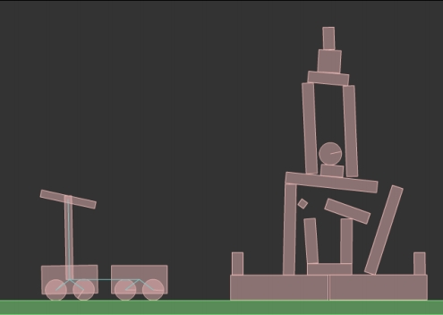

2D物理引擎 Box2D for javascript Games  第六章 关节和马达

# 关节和马达

到现在你所见到的所有类型的刚体有着一些共同点：它们都是自由的并且在除碰撞的请款之外，彼此没有依赖。

有时你可能想要刚体之间进行约束。

如果你试想一下粉碎城堡（Crush the Castle）这款游戏，投掷器是通过某种方法将一系列的刚体连接在一起而组成的。

Box2D 允许我们通过关节（joint）来创建刚体之间的约束。

关节允许我们创建复杂的对象并使我们的游戏更加真实。

在本章，你将学习怎样创建比较常见类型的关节，并且你将会发现一些别的事情，

下面是本章的知识列表：

- 通过鼠标关节拾取、拖拽以及抛掷
- 通过距离关节保持刚体之间一个固定的距离
- 使用旋转关节使刚体旋转
- 使用发动机（motor）为你的游戏赋予生命

在本章最后，你将有能力通过投掷器摧毁愤怒的小鸟的关卡。

总之，关节也可以通过拾取和拖拽来实现刚体的交互。

这是你要学习的第一种类型的关节。

## 拾取并拖拽刚体——鼠标关节

最难的事情最先做

我们将从最难的关节之一开始

虽然蛋疼，但是必须去做，因为这样将使我们创建并测试别的关节变的容易（当你完成了很困难的事情后，转而去做相对简单些的事情时，这些事情将变得更加容易）

一个鼠标关节允许玩家通过鼠标来移动刚体，我们将创建具有以下特性的鼠标关节：

- 通过在刚体上点击来拾取它
- 只要按钮按下，刚体将随鼠标移动
- 一旦按钮被释放，刚体也将被释放

开始的步骤与你通过本书已经掌握的脚本并无什么区别

1. 在 main()方法中没有什么新的东西，只是放置了两个盒子形状到舞台上：
   
   大的 static 类型的地面和在其上面的很小的 dynamic 类型的盒子

   ```
   function main(){
      world = new b2World(gravity, sleep);
      debugDraw();

      // 地面
      var bodyDef  = new b2BodyDef();
      bodyDef.position.Set(320 / worldScale, 470 / worldScale);
      var polygonShape  = new b2PolygonShape();
      polygonShape.SetAsBox(320 / worldScale, 10 / worldScale);
      var fixtureDef  = new b2FixtureDef();
      fixtureDef.shape = polygonShape;
      var groundBody = world.CreateBody(bodyDef);
      groundBody.CreateFixture(fixtureDef);

      // 小盒子
      bodyDef.position.Set(320 / worldScale, 430 / worldScale);
      bodyDef.type = b2Body.b2_dynamicBody;
      polygonShape.SetAsBox(30 / worldScale, 30 / worldScale);
      fixtureDef.density = 1;
      fixtureDef.friction = 0.5;
      fixtureDef.restitution = 0.2;
      var box2 = world.CreateBody(bodyDef);
      box2.CreateFixture(fixtureDef);

      setInterval(updateWorld, 1000 / 60);
      
      document.querySelector('#canvas').addEventListener('mousedown', createJoint)
   }
   ```

2. 不要为在 mousedown 监听中 createJoint() 回调方法而烦恼 
   
   目前，我们没有创建任何关节，所以我们只是通过当我们学习怎样销毁刚体时的相同的方式来查询世界

   ```
   function createJoint(e){
      world.QueryPoint(queryCallback, mouseToWorld(e));
   }
   ```
3. 现在来看看 mouseToWorld() 方法，因为我们将要对鼠标的坐标进行很多的操作，我创建一个小方法将鼠标坐标转变成b2Vec2对象的世界坐标。

   ```
   function mouseToWorld(e) {
      const mouseX = e.x;
      const mouseY = e.y;
      return new b2Vec2(mouseX/worldScale,mouseY/worldScale);
   }
   ```
4. queryCallback() 方法只是通过 GetType() 方法检测刚体是否是 dynamic 类型的
   
   所以，很显然你希望检测的刚体是 dynamic 类型的，这样你将可以拖拽这个刚体。
   
   在这一步，我们只是将一些文本从输出窗口中输出：

   ```
   function queryCallback(fixture)  {
      var touchedBody = fixture.GetBody();
      if (touchedBody.GetType() === b2Body.b2_dynamicBody) {
            console.log("will create joint here");
      }
      return false;
   }
   ```

5. 其它常规的 updateWorld、debugDraw 与之前章节中无异
   
   测试网页:

   

6. 直到你点击地面上的 dynamic 类型的盒子时，否则将不会有任何事情发生，这时将会立即在输出窗口出现下面的文本
   
   will create joint here

   事实上此处就是我们要创建鼠标关节的地方

   源码： `article/ch06/ch06-1.html`

7. 关节（Joints）类在别的包中，我们将它导入进来命名为 :
   
   ```
   b2MouseJoint = Box2D.Dynamics.Joints.b2MouseJoint
   ```

8. 然后我们还要声明一个新的类变量，它将存储我们的鼠标关节（mouse joint）
   
   ```
   let mouseJoint;
   ```

   在这里非常直观，b2MouseJoint 类是我们用来处理鼠标关节的，所以我声明一个该类型的变量，叫做 mouseJoint。

9. 最后，让我们来创建关节（Joint）。
   
   一旦我们得知玩家尝试拾取一个 dynamic 类型的刚体，我们需要在 queryCallback() 方法中来实现关节的创建。

   ```
   function queryCallback(fixture, e)  {
      var touchedBody = fixture.GetBody();
      if (touchedBody.GetType() === b2Body.b2_dynamicBody) {
            var jointDef = new b2MouseJointDef();
            jointDef.bodyA = world.GetGroundBody();
            jointDef.bodyB = touchedBody;
            jointDef.target = mouseToWorld(e);
            jointDef.maxForce = 1000 * touchedBody.GetMass();
            mouseJoint = world.CreateJoint(jointDef);
            stage.addEventListener('mousemove', moveJoint);
            stage.addEventListener('mouseup', killJoint);
      }
      return false;
   }
   ```

   这里有一些新的代码，所以让我们来一行行的解析它：

   ```
   var jointDef = new b2MouseJointDef();
   ```

   我们创建一个 b2MouseJoint 对象。
   
   在这里，创建关节与创建刚体没有什么不同。
   
   无论哪种情况我们都要有一个与所有调整参数以及刚体或关节自身相关的定义。
   
   所以我们创建了关节的定义。

   现在，我们需要一些关节参数，例如：通过关节连接的刚体。

   ```
   jointDef.bodyA = world.GetGroundBody();
   jointDef.bodyB = touchedBody;
   ```

   指定 bodyA 和 bodyB 属性为通过关节连接起来的刚体。
   
   因为我们将一个刚体和鼠标连接在一起，所以 bodyA 将是地面刚体（ground body）。

   地面刚体（ground body）不是我们自己创建的用作地面的 static 类型的盒子刚体，它是不可见的，不可触摸的刚体，它代表了 Box2D 世界。
   
   在现实世界中，地面刚体（ground body）就是围绕着我们的空气。
   
   它无处不在，但是我们却看不见摸不着。

   另一面，bodyB 是我们刚要点击的刚体，所以我们将说：“被点击的刚体将要被定到世界中给定的点上”。
   
   那一个点？
   
   当然是鼠标指针坐标，这要归功于 target 属性带来的便利，它允许我们指派 b2Vec2 对象的坐标
   
   然后就是 mouseToWorld() 方法出场的时候了：

   ```
   jointDef.target = mouseToWorld(e);
   ```

   现在，你可以在舞台上拖拽你的鼠标，然后刚体将如你所期望的跟随鼠标的指针。
   
   Box2D 将为你处理这些事情，可是你需要为关节指定作用力（force）。
   
   作用力越大，当你移动鼠标时刚体响应也将更加迅速。试想一下，在你的鼠标指针与刚体之间有一个橡皮带连接着。
   
   弹性越大，移动越精确

   maxForce 属性允许我们设置关节的最大作用力。
   
   我依据刚体的质量设置了一个很大的值：

   ```
   jointDef.maxForce=1000*touchedBody.GetMass();
   ```

   现在一切都决定好了，然后我们准备将在上面我们刚刚结束的定义基础上创建关节。
   
   所以，让我们通过 CreateJoint() 方法将关节添加到世界中：

   ```
   mouseJoint=world.CreateJoint(jointDef)
   ```

10. 现在，我们完成了关节。
    
   总之，大家将期望在保持按下鼠标的左键按钮后，只要移动鼠标，刚体也将移动，或者一旦释放鼠标左键，刚体也将被释放。
   
   所以，首先我们需要添加两个监听，来检测当鼠标移动和鼠标左键被释放时所发生的事件：

   ```
   stage.addEventListener('mousemove', moveJoint);
   stage.addEventListener('mouseup', killJoint);
   ```

   > 注： stage 为 `const stage = document.querySelector('#canvas');` 网页上的 canvas

11. 现在，回调方法 moveJoint() 将在鼠标使用时被调用，然后它只要更新关节的目标即可。
    
   在之前的部分通过 target 属性设置的 b2MouseJointDef 对象的目标，你是否还记得呢？
   
   现在你可以直接通过 b2MouseJoint 自身的 SetTarget() 方法来更新目标。
   
   哪儿是新的目标的位置呢？新的鼠标位置：

   ```
   function moveJoint(e){
      mouseJoint.SetTarget(mouseToWorld(e));
   }
   ```

12. 当鼠标的左键被释放，killJoint 方法将被调用，所以我们将通过 Destroy() 方法移除关节，这和我们销毁刚体时使用的 DestroyBody() 一样。
    
   此外，将关节的变量设置为 null，然后显示的移除监听：

   ```
   function killJoint(e){
      world.DestroyJoint(mouseJoint);
      mouseJoint = null;
      stage.removeEventListener('mousemove', moveJoint);
      stage.removeEventListener('mouseup', killJoint);
   }
   ```

   现在你可以去拾取另一个刚体了。
   
   但是糟糕的是，世界中只有一个 dynamic 类型的刚体，但是我们将在几秒钟内添加很多东西。

13. 测试网页，拾取并拖拽 dynamic 类型的盒子。
    
   在调试绘图中将以一条蓝绿色的线来代表关节，并且箭头代表了鼠标移动的方向

   

   源码： `article/ch06/ch06-2.html`

   现在，你能够拖拽并抛掷刚体了，让我们来创建一个新的盒子吧，然后学习另一种类型的关节。

## 让刚体之间保持给定的距离——距离关节

距离关节可能是最容易理解和处理的关节。

它只需要设置两个对象的点之间的距离，然后，无论发生什么，它都将保持对象的点之间的距离为你所设置的数值。

所以，我创建一个新的盒子并将它与之前已经存在于这个世界的盒子通过距离关节连接在一起。

让我们来对 main() 方法做一些小的改动吧：

```
function main(){   
   world = new b2World(gravity, sleep);
   debugDraw();

   // 地面
   var bodyDef  = new b2BodyDef();
   bodyDef.position.Set(320 / worldScale, 470 / worldScale);
   var polygonShape  = new b2PolygonShape();
   polygonShape.SetAsBox(320 / worldScale, 10 / worldScale);
   var fixtureDef  = new b2FixtureDef();
   fixtureDef.shape = polygonShape;
   var groundBody = world.CreateBody(bodyDef);
   groundBody.CreateFixture(fixtureDef);

   // 小盒子
   bodyDef.position.Set(320 / worldScale, 430 / worldScale);
   bodyDef.type = b2Body.b2_dynamicBody;
   polygonShape.SetAsBox(30 / worldScale, 30 / worldScale);
   fixtureDef.density = 1;
   fixtureDef.friction = 0.5;
   fixtureDef.restitution = 0.2;
   var box2 = world.CreateBody(bodyDef);
   box2.CreateFixture(fixtureDef);

   bodyDef.position.Set(420/worldScale,430/worldScale);
   var box3 = world.CreateBody(bodyDef);
   box3.CreateFixture(fixtureDef);
   var dJoint = new b2DistanceJointDef();
   dJoint.bodyA = box2;
   dJoint.bodyB = box3;
   dJoint.localAnchorA = new b2Vec2(0,0);
   dJoint.localAnchorB = new b2Vec2(0,0);
   dJoint.length = 100 / worldScale;
   var distanceJoint = world.CreateJoint(dJoint);
   
   setInterval(updateWorld, 1000 / 60);
   
   stage.addEventListener('mousedown', createJoint)
}
```


对于刚刚创建的 box3 刚体我们没有什么需要注释的，它只是我们创建的又一个盒子而已，但是我将要一行行的来说明一下创建的距离关节

```
var dJoint = new b2DistanceJointDef();
```

首先，你应该使用 Box2D 的方式来创建关节的定义，所以在这里使用 b2DistanceJointDef 来创建距离关节的定义。

> 注意，请自己在程序开始处引入 b2DistanceJointDef = Box2D.Dynamics.Joints.b2DistanceJointDef


和鼠标关节一样，距离关节也有属性需要定义，所以我们将再次看到 bodyA和 bodyB 属性，这时为它们分配两个 dynamic 类型的盒子

```
dJoint.bodyA = box2;
dJoint.bodyB = box3;
```

然后，我们需要定义关节绑定到两个刚体上的点。

localAnchorA 和 localAnchorB 属性定义你要应用的距离关节绑定到刚体上的本地点。

注意这些本地点，它们采用的坐标为刚体自身内的坐标（在本地点中，刚体中心位置坐标为（0,0）），与刚体相对世界的坐标位置无关

```
dJoint.localAnchorA = new b2Vec2(0,0);
dJoint.localAnchorB = new b2Vec2(0,0);
```

最后，来定义关节的长度，这是一个在 localAnchorA 和 localAnchorB 所定义的点之间不变的距离。

这些盒子分别创建在（320,430）和（420,430）的位置，所以，这里的距离是 100 像素。

我们不打算修改这个数值，所以 length 属性将是

```
dJoint.length=100/worldScale;
```

现在，关节定义准备在世界中来创建关节，这些都要归功于 b2DistanceJoint 对象——像往常一样创建并添加关节到世界中：

```
var distanceJoint = world.CreateJoint(dJoint);
```

现在，你可以测试网页，拾取并拖拽任何一个dynamic类型的刚体，但是，在刚体上起源点（0,0）之间距离不会改变，这要感谢距离关节。


源码： `article/ch06/ch06-3.html`

虽然你可以通过鼠标和距离关节做很多事情，但是这里还有另一种类型的关节，它是游戏设计中的万金油（原文翻译为：它是游戏设计中的救生圈）：旋转关节

## 使刚体绕一个点旋转——旋转关节

旋转关节将两个刚体绑定到彼此的共有的锚点上，这样刚体就只剩下一个自由度：绕着锚点旋转。

一个最常见使用旋转关节的地方是创建轮子和齿轮。

我们将在稍后搭建攻城机（一个投掷石块的抛掷器）时，创建轮子。

目前，我只想添加另一个盒子到我们的脚本中然后将它绑定到地面刚体（在鼠标关节的介绍中曾提到过，它就像真实世界的空气）上，让你看到怎样与旋转关节交互。

我们只需要对 main() 方法做些许的改变, 在 var distanceJoint... 代码后添加上：

```
bodyDef.position.Set(320/worldScale,240/worldScale);
var box4 = world.CreateBody(bodyDef);
box4.CreateFixture(fixtureDef);
var rJoint = new b2RevoluteJointDef();
rJoint.bodyA = box4;
rJoint.bodyB = world.GetGroundBody();
rJoint.localAnchorA = new b2Vec2(0,0);
rJoint.localAnchorB = box4.GetWorldCenter();
var revoluteJoint = world.CreateJoint(rJoint);
```

像往常一样，对于创建的 box4 没有什么好说的，不过我将一行行的来解释关节的创建，它是从定义 b2RevoluteJointDef 开始的

> 注: 在程序顶部记得引入  var b2RevoluteJointDef = Box2D.Dynamics.Joints.b2RevoluteJointDef

```
var rJoint = new b2RevoluteJointDef();
```

处理过程和之前的方式一样，将我们最新创建的盒子和地面刚体分配给 bodyA 和 bodyB 属性:

```
rJoint.bodyA = box4;
rJoint.bodyB = world.GetGroundBody();
```

现在，将本地锚点关联到刚体上，它们分别是盒子的起源点（0,0）和该点在世界中的坐标。

```
rJoint.localAnchorA = new b2Vec2(0,0);
rJoint.localAnchorB = box4.GetWorldCenter();
```

那么现在，我们来创建旋转关节自身：

```
var revoluteJoint = world.CreateJoint(rJoint);
```

测试网页，然后与最新创建的盒子进行交互：

尝试拖拽它、将别的盒子放置到它的上面，做任何你想要做的事情。

可是你没有办法移动它，因此它将只是绕着它的锚点旋转。


源码： `article/ch06/ch06-4.html`


这里有很多 Box2d  支持的关节类型，但是列举出它们并解释所有的关节已超出本书的范围。

我想要你学习的是怎样使 Box2D 来增强游戏，而鼠标、距离以及旋转关节已经可以让你实现几乎所有的事情。

你可以通过参考官方文档来获取完整的关节列表信息：http://box2d.org/manual.pdf

所以，我没有将那些没有意义的 Box2D 关节一一列举，我将向你展示一些确实关联到游戏开发的东西：一个攻城机（粉碎城堡一款android的游戏中的攻城器械）。

## 当愤怒的小鸟遇见粉碎城堡

如果小鸟有一个攻城机会怎样呢？让我们来探索这个游戏的设置吧！

但是，首先让我来说明一下我想要只使用距离和旋转关节来搭建的攻城机类型。

攻城机是由两个安装了轮子的挂车组成。

第一个手推车可以通过玩家控制并且它是作为卡车的车头。

第二个挂车只是一个挂车，但是在它的上面有一个投石器。

是不是有点困惑？让我想你展示一下它的原型吧：


这里有很多事情要做，所以我们立即开始吧。

1. 开始的一步在本书中已经无数次写过了，main 函数改造成：
   
   ```
   function main(){
      world = new b2World(gravity, sleep);
      debugDraw();

      ground();
      var frontCart = addCart(200,430);
      var rearCart = addCart(100,430);
      setInterval(updateWorld, 1000 / 60);
   }
   ```

2. 像往常我们创建一个新世界一样，一个调试绘图惯例，一个地面以及一个监听添加（流程中的公有方法调用）
   
   这样做是为了保证我们在这些流程中没有遗漏，ground() 方法如往常一样创建一个大的 static 类型的刚体作为地面，如下所示：

   ```
   function ground()  {
      var bodyDef = new b2BodyDef();
      bodyDef.position.Set(320/worldScale,470/worldScale);
      var polygonShape = new b2PolygonShape();
      polygonShape.SetAsBox(320/worldScale,10/worldScale);
      var fixtureDef = new b2FixtureDef();
      fixtureDef.shape = polygonShape;
      var groundBody = world.CreateBody(bodyDef);
      groundBody.CreateFixture(fixtureDef);
   }
   ```

3. 在 main() 方法中唯一不同的是 addCart() 方法，它只是用来添加一个盒子形状并给与坐标，总的来说，这里也没有什么新的东西：
   
   ```
   function addCart(pX, pY) {
      var bodyDef = new b2BodyDef();
      bodyDef.position.Set(pX / worldScale, pY / worldScale);
      var polygonShape = new b2PolygonShape();
      polygonShape.SetAsBox(40 / worldScale, 20 / worldScale);
      var fixtureDef = new b2FixtureDef();
      fixtureDef.shape = polygonShape;
      fixtureDef.density = 1;
      fixtureDef.restitution = 0.5;
      fixtureDef.friction = 0.5;
      var body = world.CreateBody(bodyDef);
      body.CreateFixture(fixtureDef);
      var frontWheel = addWheel(pX + 20, pY + 15);
      var rearWheel = addWheel(pX - 20, pY + 15);
      return body;
   }
   ```

4. 方法的最后，返回刚体之前，这里调用了两次addWheel()方法，它将在给定的坐标创建一个球型。
   
   说到这里也就没有什么新的东西可说了，但是你将看到我们的攻城机是个什么形状了。

   ```
   function addWheel(pX, pY) {
      var bodyDef = new b2BodyDef();
      bodyDef.position.Set(pX / worldScale, pY / worldScale);
      var circleShape = new b2CircleShape(0.5);
      var fixtureDef = new b2FixtureDef();
      fixtureDef.shape = circleShape;
      fixtureDef.density = 1;
      fixtureDef.restitution = 0.5;
      fixtureDef.friction = 0.5;
      var body = world.CreateBody(bodyDef);
      body.CreateFixture(fixtureDef);
      return body;
   }
   ```

5. 在 debugDraw() 方法内确保有下面这一句，它将向我们呈现出关节:
   
   ```
   debugDraw.SetFlags(b2DebugDraw.e_shapeBit | b2DebugDraw.e_jointBit);
   ```

6. 此刻，两个static类型的挂车将被创建
   
   测试网页然后检查一切是否看起来正常：

   

   源码： `article/ch06/ch06-5.html`

   > 记住，当你在Box2D世界中创建新的东西时，请使用static类型的刚体来查看，在没有重力、作用力以及碰撞的情况下，你的模型的样子。

   现在，一切看起来都不错，让我们将刚体变为 dynamic 类型然后添加需要的关节。

7. 通过在 addWheel() 方法和 addCart() 方法中添加 type 属性将轮子和挂车设置为 dynamic 类型的刚体。
   
   addWheel() 方法内添加：

   ```
   bodyDef.type = b2Body.b2_dynamicBody;
   ```

8. 然后，addCart() 方法也要做同样的修改：   

   ```
   function addCart(pX, pY) {
      var bodyDef = new b2BodyDef();
      bodyDef.type = b2Body.b2_dynamicBody;
      bodyDef.position.Set(pX / worldScale, pY / worldScale);
      var polygonShape = new b2PolygonShape();
      polygonShape.SetAsBox(40 / worldScale, 20 / worldScale);
      var fixtureDef = new b2FixtureDef();
      fixtureDef.shape = polygonShape;
      fixtureDef.density = 1;
      fixtureDef.restitution = 0.5;
      fixtureDef.friction = 0.5;
      var body = world.CreateBody(bodyDef);
      body.CreateFixture(fixtureDef);
      var frontWheel = addWheel(pX + 20, pY + 15);
      var rearWheel = addWheel(pX - 20, pY + 15);

      var rJoint = new b2RevoluteJointDef();
      rJoint.bodyA = body;
      rJoint.bodyB = frontWheel;
      rJoint.localAnchorA.Set(20 / worldScale, 15 / worldScale);
      rJoint.localAnchorB.Set(0, 0);
      var revoluteJoint = world.CreateJoint(rJoint);
      rJoint.bodyB = rearWheel;
      rJoint.localAnchorA.Set(-20 / worldScale, 15 / worldScale);
      revoluteJoint = world.CreateJoint(rJoint);
      return body;
   }
   ```

   但是，在 addCart() 方法中添加的代码并不止这些。
   
   如你所见，我添加了两个旋转关节分别将每个轮子的起源点（0,0）与挂车绑定在一起。
   
   不要担心通过旋转关节绑定在一起的刚体之间的碰撞。

9. 最后，我们需要一个距离关节来管理两个挂车之间的距离，将它们添加到 main() 方法中：

   ```
    function main() {
      world = new b2World(gravity, sleep);
      debugDraw();

      ground();
      var frontCart = addCart(200, 430);
      var rearCart = addCart(100, 430);

      var dJoint = new b2DistanceJointDef();
      dJoint.bodyA = frontCart;
      dJoint.bodyB = rearCart;
      dJoint.localAnchorA = new b2Vec2(0, 0);
      dJoint.localAnchorB = new b2Vec2(0, 0);
      dJoint.length = 100 / worldScale;
      var distanceJoint = world.CreateJoint(dJoint);

      setInterval(updateWorld, 1000 / 60);
   }
   ```

10. 目前，在这里没有什么新的东西，但是你可以去开始构建你的攻城机。
    
   测试网页：

   

   源码： `article/ch06/ch06-6.html`

你的挂车现在有轮子并且他们通过一个距离关节连接在了一起。

现在我们必须介绍一些新的东西，来让玩家移动这个挂车  

## 通过马达控制关节

有些关节，例如旋转关节有一个马达的特性，在这种情况下，除非给定的最大扭矩超出范围，不然在给定的速度下，可以使用它来旋转关节。

学习马达将让你可以去开发在网页上看到的任何汽车/卡车游戏

1. 创建卡车，我们需要在最右边的挂车上应用一个马达，所以在 addCart() 方法中，我们添加一个参数来告知我们创建的挂车是否需要一个马达。
   
   改变 main() 方法，指定 frontCart 将要一个马达，而 rearCart 不需要：

   ```
   var frontCart = addCart(200, 430, true);
   var rearCart = addCart(100, 430, false);
   ```
2. 因此，addCart() 方法的声明也将要发生改变，但是这并不是什么新鲜事了。
   
   我希望你注意添加的判断 motor为 true 的代码：

   ```
   function addCart(pX, pY, motor) {
      var bodyDef = new b2BodyDef();
      bodyDef.type = b2Body.b2_dynamicBody;
      bodyDef.position.Set(pX / worldScale, pY / worldScale);
      var polygonShape = new b2PolygonShape();
      polygonShape.SetAsBox(40 / worldScale, 20 / worldScale);
      var fixtureDef = new b2FixtureDef();
      fixtureDef.shape = polygonShape;
      fixtureDef.density = 1;
      fixtureDef.restitution = 0.5;
      fixtureDef.friction = 0.5;
      var body = world.CreateBody(bodyDef);
      body.CreateFixture(fixtureDef);
      var frontWheel = addWheel(pX + 20, pY + 15);
      var rearWheel = addWheel(pX - 20, pY + 15);

      var rJoint = new b2RevoluteJointDef();
      rJoint.bodyA = body;
      rJoint.bodyB = frontWheel;
      rJoint.localAnchorA.Set(20 / worldScale, 15 / worldScale);
      rJoint.localAnchorB.Set(0, 0);

      if (motor) {
         rJoint.enableMotor = true;
         rJoint.maxMotorTorque = 1000;
         rJoint.motorSpeed = 5;
      }

      var revoluteJoint = world.CreateJoint(rJoint);
      rJoint.bodyB = rearWheel;
      rJoint.localAnchorA.Set(-20 / worldScale, 15 / worldScale);
      revoluteJoint = world.CreateJoint(rJoint);
      return body;
   }
   ```

   让我们来看看新的代码：

   ```
   rJoint.enableMotor = true;
   ```

   b2RevoluteJointDef 的 enableMotor 是一个布尔值属性。
   
   它的默认值是 false，但是设置它为 true 将允许我们添加为旋转关节添加一个马达。

   ```
   rJoint.maxMotorTorque = 1000;
   ```
   maxMotorTorque 属性是马达可以应用的最大扭力的定义。它的值越大，马达越加的强劲。
   
   请注意该属性不控制马达的速度，但是最大扭力可以用来达到理想的转速。它的计量单位是牛顿米或Nm。
   
   最后，motorSpeed 属性设置期望的马达速度，计量单位是弧度/秒：

   rJoint.motorSpeed = 5;

3. 结尾，三行与马达相关的代码意味着：可以使用马达和设置它的速度为5度/秒，使用最大扭矩为 1000 Nm

4. 测试网页，然后看着你的挂车向右运动：
   
   

   源码： `article/ch06/ch06-7.html`


现在你可以使挂车移动了。但是怎样通过一个键盘输入来移动挂车呢？

## 通过键盘控制马达

我们希望玩家通过方向键来控制挂车。

左方向键将挂车向左移动而右方向键将挂车向右移动。

1. 让玩家通过键盘控制马达，你需要一些新的类变量
   
   ```
   let left = false;
   let right = false;
   let frj;
   let rrj;
   let motorSpeed = 0;
   ```

   left 和 right是布尔值变量，它将让我们知道左或右方向键是否被按下。
   
   frj 和 rrj 分别是前后的旋转关节。
   
   你可能会对变量名产生困惑，但是我这样做是为了便于代码的布局而尽量使用较少的字母。

   （变量名分别是front/rear revolute joint的首字母缩写）

   motorSpeed 是当前马达的速度，初始值为 0

2. 在 main()方法中，我们添加了当玩家按下或释放按键时触发的事件监听：
   
   ```
   document.addEventListener("keydown", keyPressed)
   document.addEventListener("keyup", keyReleased)
   ```
3. 同时在下面的回调方法中。当玩家按下左或右方向键时，left 或 right将变成:

   ```
   function keyPressed(e) {
      switch (e.keyCode) {
            case 37:
               left = true;
               break;
            case 39:
               right = true;
               break;
      }
   }
   ```
   
   通过相同的方式，当玩家按下左或右方向键时，left 或 right将变成 false：

   ```
   function keyReleased(e) {
      switch (e.keyCode) {
            case 37:
               left = false;
               break;
            case 39:
               right = false;
               break;
      }
   }
   ```
   
4. 在 addCart() 方法中有一些改变，但是这些大多是为了区别旋转关节是否带有马达，它是通过键盘控制还是被动的旋转关节。
   
   ```
   function addCart(pX, pY, motor) {
      var bodyDef = new b2BodyDef();
      bodyDef.type = b2Body.b2_dynamicBody;
      bodyDef.position.Set(pX / worldScale, pY / worldScale);
      var polygonShape = new b2PolygonShape();
      polygonShape.SetAsBox(40 / worldScale, 20 / worldScale);
      var fixtureDef = new b2FixtureDef();
      fixtureDef.shape = polygonShape;
      fixtureDef.density = 1;
      fixtureDef.restitution = 0.5;
      fixtureDef.friction = 0.5;
      var body = world.CreateBody(bodyDef);
      body.CreateFixture(fixtureDef);


      var frontWheel = addWheel(pX + 20, pY + 15);
      var rearWheel = addWheel(pX - 20, pY + 15);
      var rJoint = new b2RevoluteJointDef();
      rJoint.bodyA = body;
      rJoint.bodyB = frontWheel;
      rJoint.localAnchorA.Set(20 / worldScale, 15 / worldScale);
      rJoint.localAnchorB.Set(0, 0);

      if (motor) {
            rJoint.enableMotor = true;
            rJoint.maxMotorTorque = 1000;
            rJoint.motorSpeed = 0;
            frj = world.CreateJoint(rJoint);
      } else {
            var rj = world.CreateJoint(rJoint);
      }

      rJoint.bodyB = rearWheel;
      rJoint.localAnchorA.Set(-20 / worldScale, 15 / worldScale);

      if (motor) {
            rrj = world.CreateJoint(rJoint);
      } else {
            rj = world.CreateJoint(rJoint);
      }
      return body;
   }
   ```

   主要的不同是用来创建旋转关节的变量。
   
   前挂车需要马达将使用 frj 和 rrj 类变量 来代表旋转关节，而后挂车不需要马达只要使用本地变量即可。

5. 核心的脚本编写在 updateWorld() 方法中
   
   它依据被按下的按键来调节 motorSpeed 变量(我通过每次乘以0.99来模拟惯性和摩擦力)，
   
   极限速度是 5 或 -5，然后更新旋转关节的马达速度。

   ```
   function updateWorld() {
      if (left) {
            motorSpeed -= 0.1;
      }
      if (right) {
            motorSpeed += 0.1;
      }
      motorSpeed * 0.99;
      if (motorSpeed > 5) {
            motorSpeed = 5;
      }
      if (motorSpeed < -5) {
            motorSpeed = -5;
      }
      frj.SetMotorSpeed(motorSpeed);
      rrj.SetMotorSpeed(motorSpeed);
      world.Step(1 / 30, 10, 10);// 更新世界模拟
      world.DrawDebugData(); // 显示刚体debug轮廓
      world.ClearForces(); // 清除作用力
   }
   ```
6. SetMotorSpeed 方法将直接作用于旋转关节(而不是它的定义)从而允许 我们及时更新马达的速度。   

7. 测试网页，你将可以通过左右方向键来控制挂车
      
   

   源码： `article/ch06/ch06-8.html`

现在，我们有一个可以运行的挂车，但是不要忘记在这儿我们还没有搭建支架，使用攻城机来摧毁小猪的藏匿处。

## 让一些刚体不要发生碰撞——碰撞过滤

不要被标题唬住了：我们将搭建攻城机，但是这将没有什么新的东西，而我希望你在每一步的学习中都能学习到新的知识，所以本节的主要目的是学习碰撞过滤。

1. 首先要做，是让我们来搭建攻城机。
   
   投掷器将通过距离关节被绑定到挂车上，这使我们能够发射摧毁性的石块，所以我们需要把它作为类变量：

   ```
   let sling; 
   ```

2. 在挂车上的攻城机的构造并不复杂，当 motor 为 false 时，这里的代码量增加了不少，这是为了在不使用马达的挂车上搭建攻城机。

   在上一节源码 addCard 方法内增加: 

   ```
   function addCart(pX, pY, motor) {
      var bodyDef = new b2BodyDef();
      bodyDef.type = b2Body.b2_dynamicBody;
      bodyDef.position.Set(pX / worldScale, pY / worldScale);
      var polygonShape = new b2PolygonShape();
      polygonShape.SetAsBox(40 / worldScale, 20 / worldScale);
      var fixtureDef = new b2FixtureDef();
      fixtureDef.shape = polygonShape;
      fixtureDef.density = 1;
      fixtureDef.restitution = 0.5;
      fixtureDef.friction = 0.5;
      var body = world.CreateBody(bodyDef);
      body.CreateFixture(fixtureDef);

      if (!motor) {
         // 垂直长臂
         var armOrigin = new b2Vec2(0, -60 / worldScale);
         var armW = 5 / worldScale
         var armH = 60 / worldScale
         polygonShape.SetAsOrientedBox(armW, armH, armOrigin);
         body.CreateFixture(fixtureDef);
         // 旋转臂
         bodyDef.position.Set(pX / worldScale, (pY - 115) / worldScale);
         polygonShape.SetAsBox(40 / worldScale, 5 / worldScale);
         fixtureDef.shape = polygonShape;
         fixtureDef.filter.categoryBits = 0x0002;
         fixtureDef.filter.maskBits = 0x0002;
         var arm = world.CreateBody(bodyDef);
         arm.CreateFixture(fixtureDef);
         //旋转关节
         var armJoint = new b2RevoluteJointDef();
         armJoint.bodyA = body;
         armJoint.bodyB = arm;
         armJoint.localAnchorA.Set(0, -115 / worldScale);
         armJoint.localAnchorB.Set(0, 0);
         armJoint.enableMotor = true;
         armJoint.maxMotorTorque = 1000;
         armJoint.motorSpeed = 6;
         var siege = world.CreateJoint(armJoint);
         // 抛掷物
         var projectileX = (pX - 80) / worldScale;
         var projectileY = (pY - 115) / worldScale;
         bodyDef.position.Set(projectileX, projectileY);
         polygonShape.SetAsBox(5 / worldScale, 5 / worldScale);
         fixtureDef.shape = polygonShape;
         fixtureDef.filter.categoryBits = 0x0004;
         fixtureDef.filter.maskBits = 0x0004;
         var projectile = world.CreateBody(bodyDef);
         projectile.CreateFixture(fixtureDef);
         // 距离关节
         var slingJoint = new b2DistanceJointDef();
         slingJoint.bodyA = arm;
         slingJoint.bodyB = projectile;
         slingJoint.localAnchorA.Set(-40 / worldScale, 0);
         slingJoint.localAnchorB.Set(0, 0);
         slingJoint.length = 40 / worldScale;
         sling = world.CreateJoint(slingJoint);
      }

      var frontWheel = addWheel(pX + 20, pY + 15);
      var rearWheel = addWheel(pX - 20, pY + 15);
      var rJoint = new b2RevoluteJointDef();
      rJoint.bodyA = body;
      rJoint.bodyB = frontWheel;
      rJoint.localAnchorA.Set(20 / worldScale, 15 / worldScale);
      rJoint.localAnchorB.Set(0, 0);

      if (motor) {
            rJoint.enableMotor = true;
            rJoint.maxMotorTorque = 1000;
            rJoint.motorSpeed = 0;
            frj = world.CreateJoint(rJoint);
      } else {
            var rj = world.CreateJoint(rJoint);
      }

      rJoint.bodyB = rearWheel;
      rJoint.localAnchorA.Set(-20 / worldScale, 15 / worldScale);

      if (motor) {
            rrj = world.CreateJoint(rJoint);
      } else {
            rj = world.CreateJoint(rJoint);
      }
      return body;
   }
   ```

   让我们一段一段的来分析这些代码

   ```
   var armOrigin = new b2Vec2(0, -60 / worldScale);
   var armW = 5 / worldScale
   var armH = 60 / worldScale
   polygonShape.SetAsOrientedBox(armW, armH, armOrigin);
   body.CreateFixture(fixtureDef);
   ```

   上面的 5 行代码在抛掷器和挂车之间创建了一个垂直的“长臂”。
   
   垂直支撑条是挂车的一部分，正如它的夹具被添加到相同的刚上。
   
   它是个复合对象。

   ```
   bodyDef.position.Set(pX / worldScale, (pY - 115) / worldScale);
   polygonShape.SetAsBox(40 / worldScale, 5 / worldScale);
   fixtureDef.shape = polygonShape;
   fixtureDef.filter.categoryBits = 0x0002;
   fixtureDef.filter.maskBits = 0x0002;
   var arm = world.CreateBody(bodyDef);
   arm.CreateFixture(fixtureDef);
   ```

   这是一个旋转臂，投掷器的一部分。
   
   它是作为一个单独刚体被创建的，因此它将通过旋转关节绑定到挂车的垂直支撑条上。

   ```
   var armJoint = new b2RevoluteJointDef();
   armJoint.bodyA = body;
   armJoint.bodyB = arm;
   armJoint.localAnchorA.Set(0, -115 / worldScale);
   armJoint.localAnchorB.Set(0, 0);
   armJoint.enableMotor = true;
   armJoint.maxMotorTorque = 1000;
   armJoint.motorSpeed = 6;
   var siege = world.CreateJoint(armJoint);
   ```

   上面是旋转关节。它有一个马达来旋转投掷器。

   ```
   var projectileX = (pX - 80) / worldScale;
   var projectileY = (pY - 115) / worldScale;
   bodyDef.position.Set(projectileX, projectileY);
   polygonShape.SetAsBox(5 / worldScale, 5 / worldScale);
   fixtureDef.shape = polygonShape;
   fixtureDef.filter.categoryBits = 0x0004;
   fixtureDef.filter.maskBits = 0x0004;
   var projectile = world.CreateBody(bodyDef);
   projectile.CreateFixture(fixtureDef);
   ```

   抛掷物——这个刚体通过攻城机发射，它在投掷器的头部——将通过一个距离关节绑定到旋转臂上。

   ```
   var slingJoint = new b2DistanceJointDef();
   slingJoint.bodyA = arm;
   slingJoint.bodyB = projectile;
   slingJoint.localAnchorA.Set(-40 / worldScale, 0);
   slingJoint.localAnchorB.Set(0, 0);
   slingJoint.length = 40 / worldScale;
   sling = world.CreateJoint(slingJoint);
   ```


   然后，我们通过距离关节将完成投掷器。
   
   一切看起来很容易，但是你还遗漏了下面的两行在创建垂直支撑条时的代码：

   ```
   fixtureDef.filter.categoryBits = 0x0002;
   fixtureDef.filter.maskBits = 0x0002;
   ```

   下面的两行代码同样也被遗漏在创建抛掷物时：

   ```
   fixtureDef.filter.categoryBits = 0x0004;
   fixtureDef.filter.maskBits = 0x0004;
   ```

   你已经知道通过旋转关节绑定在一起的刚体之间是不会发生碰撞。
   
   不幸的是，抛掷物不是旋转关节的一部分，所以将会和垂直臂发生碰撞，所以抛掷器将无法工作，除非我们发现一种可以避免垂直臂和抛掷物之间发生碰撞的方法。

   Box2d 有一个特性是碰撞过滤，它允许你阻止夹具间的碰撞。
   
   碰撞过滤允许我们对夹具的 categoryBits 进行设置。
   
   通过这个方法，更多的夹具可以被放置在一个组中。
   
   然后，你需要为每个组指定它们将于那个组发生碰撞，通过设置 maskBits 属性

   在我们刚刚看过的四行代码中，挂车和抛掷物被放置在了不同的类别中
   
   它们被允许只能与同一类别的夹具发生碰撞，所以抛掷物和垂直臂之间将不会发生碰撞,这样抛掷器将可以自由的旋转了。

   这样做，抛掷物也将不会和地面发生碰撞，但是我们将在稍后修复这个问题。

3. 最后一件事，玩家将能够通过释放向上的方向键来销毁距离关节从而发射抛掷物，所以我们在 keyPressed() 方法中的 switch 语句中添加另一个条件
   
   ```
   function keyReleased(e) {
      switch (e.keyCode) {
            case 37:
               left = false;
               break;
            case 39:
               right = false;
               break;
            case 38 :
               world.DestroyJoint(sling);
               break;
      }
   }
   ```

   DestroyJoint 方法将从世界中移除一个关节

4. 测试网页，左右移动攻城机，然后通过上方向键发射抛掷物
   
   

   源码： `article/ch06/ch06-9.html`

这是一个很大的成就。

在 Box2D 中搭建一个攻城机并不容易，但是你做到了。那么我们开始消灭小猪吧！

## 将它们放在一起

是时候将我们知道的所有Box2D知识整合到一起了，来创建愤怒的小鸟和摧毁城堡的最终混合版吧！

1. 首先，我们对 ground() 方法做一点修改 bodyDef.position 来让它将地面放置在我们最近一次创建愤怒的小鸟模型时的地面位置相同的地方：

   ```
   function ground() {
      var bodyDef = new b2BodyDef();
      bodyDef.position.Set(320/worldScale, 465/worldScale);
      var polygonShape = new b2PolygonShape();
      polygonShape.SetAsBox(320 / worldScale, 10 / worldScale);
      var fixtureDef = new b2FixtureDef();
      fixtureDef.shape = polygonShape;
      var groundBody = world.CreateBody(bodyDef);
      groundBody.CreateFixture(fixtureDef);
   }
   ```
2. 然后，我们需要更新 main() 方法来加入自定义事件监听、砖块以及小猪
   
   ```
   function main() {
      world = new b2World(gravity, sleep);
      world.SetContactListener(new CustomContactListener());
      debugDraw();

      ground();

      brick(402,431,140,36);
      brick(544,431,140,36);
      brick(342,396,16,32);
      brick(604,396,16,32);

      brick(416,347,16,130);
      brick(532,347,16,130);
      brick(474,273,132,16);
      brick(474,257,32,16);

      brick(445,199,16,130);
      brick(503,199,16,130);
      brick(474,125,58,16);
      brick(474,100,32,32);
      brick(474,67,16,32);

      brick(474,404,64,16);
      brick(450,363,16,64);
      brick(498,363,16,64);
      brick(474,322,64,16);
      
      pig(474,232,16);
      
      var frontCart = addCart(200, 430, true);
      var rearCart = addCart(100, 430, false);
      var dJoint = new b2DistanceJointDef();
      dJoint.bodyA = frontCart;
      dJoint.bodyB = rearCart;
      dJoint.localAnchorA = new b2Vec2(0, 0);
      dJoint.localAnchorB = new b2Vec2(0, 0);
      dJoint.length = 100 / worldScale;
      var distanceJoint = world.CreateJoint(dJoint)


      document.addEventListener("keydown", keyPressed)
      document.addEventListener("keyup", keyReleased)

      setInterval(updateWorld, 1000 / 60);
   }
   ```
   
3. 很显然，你需要像最近一次创建愤怒的小鸟模型时一样，添加 brick() 和 pig() 方法，并且让 CustomContactListener 类来处理碰撞。
   
   CustomContactListener 还记得吧，在第 5 章 **Box2D 内建的碰撞监听** 一节我们自己创建的类
   
4. 然后，我们对 addCart() 方法做一点修改
   
   通过使用自定义数据（userData属性）为我们的挂车部分起一个名字，增加它们的重量——直到增加的重量通过抛掷物足够摧毁小猪的城堡，然后我们也将移除过滤。

   ```
   function addCart(pX, pY, motor) {
      ... 代码省略
      bodyDef.userData="cart";
      ... 代码省略
      ... 代码省略
      fixtureDef.density = 15;
      ... 代码省略
      bodyDef.userData="projectile";

   }
   ```
   为小车，和 抛掷物 添加 userData，将

5. 因此，我们使用一个自定义接触监听，我们将使用 CustomContactListener 类来禁止攻城机和抛掷物之间的碰撞。

6. 最后，updateWorld()方法必须也要改变，添加用来包含移除刚体的代码。
   
   ```
   function updateWorld() {
      if (left) {
            motorSpeed -= 0.1;
      }
      if (right) {
            motorSpeed += 0.1;
      }
      motorSpeed * 0.99;
      if (motorSpeed > 5) {
            motorSpeed = 5;
      }
      if (motorSpeed < -5) {
            motorSpeed = -5;
      }
      frj.SetMotorSpeed(motorSpeed);
      rrj.SetMotorSpeed(motorSpeed);
      world.Step(1 / 30, 10, 10);// 更新世界模拟
      world.DrawDebugData(); // 显示刚体debug轮廓
      world.ClearForces(); // 清除作用力
      // 移除刚体
      for (var b = world.GetBodyList(); b; b = b.GetNext()) {
            if (b.GetUserData() == "remove") {
               world.DestroyBody(b);
            }
      }
   }
   ```

7. 最后但并不意味着最少，有些关于碰撞的新知识需要学习。
   
   下面是我怎样使用 PreSolve() 回调方法来决定如果挂车与抛掷物发生碰撞，将在接触决算之前禁止碰撞发生，将这个方法添加到 CustomContactListener 类中

   ```
   PreSolve(contact, oldManifold)  {
         var fixtureA =contact.GetFixtureA();
         var fixtureB =contact.GetFixtureB();
         var dataA =fixtureA.GetBody().GetUserData();
         var dataB =fixtureB.GetBody().GetUserData();
         if (dataA=="cart" && dataB=="projectile") {
            contact.SetEnabled(false);
         }
         if (dataB=="cart" && dataA=="projectile") {
            contact.SetEnabled(false);
         }
   }
   ```

   这里都是你已经学习过的处理碰撞的知识。
   
   我只是检查发生碰撞的挂车和抛掷物，如果是，则通过 setEnabled() 方法禁止接触发生。

8. 测试网页，然后如预期的，你将有一个攻城机摧毁小猪的城堡
   
   

   源码： `article/ch06/ch06-10.html`


一切运行顺利，我们对它完全满意，不是吗？

告诉你个秘密，在某些情况下，你将会看到抛掷物似乎穿过了砖块而没有发生接触。

这个是 Box2D 的 bug 吗？或者在接触回调中有什么错误吗？

全都不是，它只是一个你还没有发现的 Box2D 的特征，不过你将会很快接触到它了。

## 小结

在本书最长也最难的一章中，你学习了怎样使用鼠标、距离以及旋转关节来使游戏设置更加的高级。

为什么不去尝试搭建一个投石机呢？


----
本文相关代码请在

https://github.com/willian12345/Box2D-for-Javascript-Games


注：转载请注明出处博客园：王二狗Sheldon池中物 (willian12345@126.com)
