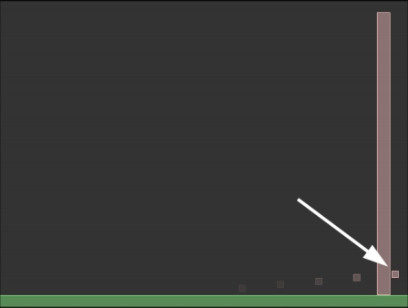
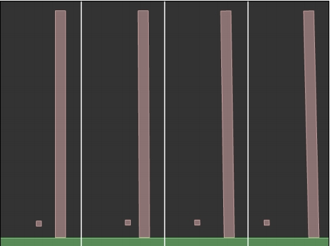
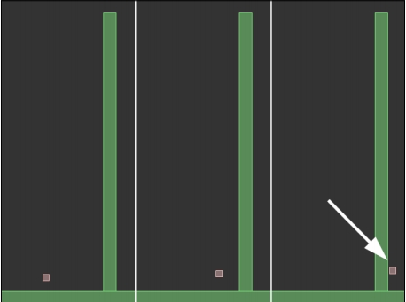

# 子弹和感应器

你知道 Box2D 可以在每一个时间步中管理刚体间的碰撞并决算它们。

总之，在愤怒的小鸟中制作攻城机器期间，发生了一些错误

你可能需要注意一下，有时抛射物会穿过城堡，忽略了碰撞。

这里发生了什么？

通常，Javascript 游戏运行在 30 与 60 帧每秒之间，如果我们使世界的时间步与帧率同步，每一个时间步将代表 1/30 到 1/60 秒。

依赖时间步的模拟叫作离散模拟，这不同于真实的世界，在真实世界中事件的发生的是连续的，我们称之为连续模拟

离散型模拟中，我们无法知道在时间中的第n步与第（n+1）步之间发生了什么

如果一个刚体的移动真的很快，那么他可以在小于一个时间步的时间之内穿过另一个刚体，你会发现它在穿过的刚体的 另一边了，而没有发生碰撞。

这个现象叫作隧道效应 (tunneling)，并且很自然的，我们想要阻止它的发生


在本章，你将学习两种不同的方式去管理刚体间的接触:

 - 设置刚体为子弹
 - 设置刚体为感应器

通过本章的学习，你将不会再对管理高速移动的刚体有任何问题

## 感受隧道效应

Box2d 默认的情况下对阻止隧道效应做的很好，使用一个连续的碰撞检测来计算离散型模拟。

不幸的是，处于性能相关的考虑，这种类型的碰撞检测只应用在 dynamic 类型刚体与 static 类型刚体之间的碰撞上。

这意味着，我们可以在两个 dynamic 类型的刚体之间产生隧道效应。

1. 让我们来看一下，下面的脚本：
   
   ```
    const stage = document.querySelector('#canvas');
    function main() {
         world = new b2World(gravity, sleep);
         debugDraw();

         var bodyDef = new b2BodyDef();
         bodyDef.position.Set(320 / worldScale, 470 / worldScale);
         var polygonShape = new b2PolygonShape();
         polygonShape.SetAsBox(320 / worldScale, 10 / worldScale);
         var fixtureDef = new b2FixtureDef();
         fixtureDef.shape = polygonShape;
         fixtureDef.density = 1;
         fixtureDef.restitution = 0.5;
         fixtureDef.friction = 0.5;
         var body = world.CreateBody(bodyDef);
         body.CreateFixture(fixtureDef);

         bodyDef.position.Set(600 / worldScale, 240 / worldScale);
         bodyDef.type = b2Body.b2_dynamicBody;
         polygonShape.SetAsBox(10 / worldScale, 220 / worldScale);
         var body2 = world.CreateBody(bodyDef);
         body2.CreateFixture(fixtureDef);
         
         bodyDef.position.Set(320 / worldScale, 455 / worldScale);
         polygonShape.SetAsBox(5 / worldScale, 5 / worldScale);
         var body3 = world.CreateBody(bodyDef);
         body3.CreateFixture(fixtureDef);
         body3.SetLinearVelocity(new b2Vec2(100, -10));
        
         stage.addEventListener('click', updateWorld);
      }
   ```

   这个脚本中没有什么新的知识。
   
   它放置了三个刚体，分别叫作 body，body2，body3，它们分别代表了一个 static 类型的地面，一个 dynamic 类型的障碍物，以及一个 dynamic 类型的小子弹。

   如你所见，子弹以一个非常快的速度（100，-10）发射，然后 updateWorld() 方法将执行世界的时间步，它不是在每一帧被调用，而是在每一次的鼠标点击时被调用。
   
   这样可以使我们一步一步的来运行模拟，如你想要的一样慢，并且我们可以看到发生了什么。

2. 测试网页，然后多次点击鼠标。
   
   

   源码： `article/ch07/ch07-1.html`

   发生了什么？抛物块在没有接触到障碍物的情况下穿过了它。
   
   我们刚刚体验了隧道效应。
   
   现在，让我们做些什么来阻止它的发生吧！


## 阻止隧道效应——设置刚体为子弹

因为连续的碰撞检测使得隧道效应无法在 static 类型的刚体上发生，

在某些情况下，我们也可以将这种方法应用到 dynamic 类型的刚体上，通过设置它们为子弹（bullets）。

一个子弹（bullets）执行连续的碰撞检测，来检测它与 static 类型的和 dynamic 类型的刚体之间的碰撞。

记住，如果你将所有的刚体都设置为子弹（bullets），你将会发现很高的性能消耗，所以这将由你在性能和精确度之间找到一个平衡点。

从我的经验来看，只是一些被玩家或敌人发射的粒子和投射物被设置为子弹（bullets），通常游戏的角色不会移动的快到需要将它们设置为子弹（bullets）

1. 在 main 函数中仅需要加入一句代码: 
    ```
    function main() {
        world = new b2World(gravity, sleep);
        debugDraw();

        var bodyDef = new b2BodyDef();
        bodyDef.position.Set(320 / worldScale, 470 / worldScale);
        var polygonShape = new b2PolygonShape();
        polygonShape.SetAsBox(320 / worldScale, 10 / worldScale);
        var fixtureDef = new b2FixtureDef();
        fixtureDef.shape = polygonShape;
        fixtureDef.density = 1;
        fixtureDef.restitution = 0.5;
        fixtureDef.friction = 0.5;
        var body = world.CreateBody(bodyDef);
        body.CreateFixture(fixtureDef);

        bodyDef.position.Set(600 / worldScale, 240 / worldScale);
        bodyDef.type = b2Body.b2_dynamicBody;
        polygonShape.SetAsBox(10 / worldScale, 220 / worldScale);
        var body2 = world.CreateBody(bodyDef);
        body2.CreateFixture(fixtureDef);

        bodyDef.position.Set(320 / worldScale, 455 / worldScale);

        // 加上这一句
        bodyDef.bullet = true;

        polygonShape.SetAsBox(5 / worldScale, 5 / worldScale);
        var body3 = world.CreateBody(bodyDef);
        body3.CreateFixture(fixtureDef);
        body3.SetLinearVelocity(new b2Vec2(100, -10));
        stage.addEventListener('click', updateWorld);
        // setInterval(updateWorld, 1000 / 60);
    }
    ```

    在刚体定义中将bullet属性设置为true将对子弹进行连续碰撞检测。

    现在应该会从障碍物上弹回。

2. 测试网页，来看看发生了什么。
   
   

   源码： `article/ch07/ch07-2.html`

   看到了吗？如你所见，接触被决算，现在子弹被障碍物弹回。

3. 将你的愤怒的小鸟模型中，通过抛掷器发射的投射物，应用bullet属性，然后将产生一个精确的模拟运行

现在，让我们来看看最后一个你在 Box2D 可以创建的特殊类型的刚体。

## 通过感应器检测接触，可以允许刚体重叠

在你的游戏中，有时你可能需要两个刚体就像没有发生任何碰撞一样重叠在一起，同时还能检测到碰撞。

使用感应器（sensor）可以实现这个功能；

感应器：一个夹具可以在检测到碰撞的情况下而不作出任何反应。

你可以使用感应器（sensor）创建刚体，所以你将可以在刚体间没有任何物理触点的情况下，知道它们之间发生的碰撞。

只要想象一下玩家控制的角色和一个开关：你想要知道当玩家控制的角色撞击开关触发一些事件，但是同时你不想开关响应玩家的碰撞。

在最后的脚本中，我们将测试一个感应器

1. 和往常一样，我们给刚体 userData 属性中添加刚体的名字
   
   将 barrier 刚体设置为 static 类型并通过 isSensor 属性定义的它的夹具为感应器。

   ```
   function main() {
        world = new b2World(gravity, sleep);
        debugDraw();

        var bodyDef = new b2BodyDef();
        bodyDef.position.Set(320 / worldScale, 470 / worldScale);
        bodyDef.userData = "floor";
        var polygonShape = new b2PolygonShape();
        polygonShape.SetAsBox(320 / worldScale, 10 / worldScale);
        var fixtureDef = new b2FixtureDef();
        fixtureDef.shape = polygonShape;
        fixtureDef.density = 1;
        fixtureDef.restitution = 0.5;
        fixtureDef.friction = 0.5;
        fixtureDef.isSensor = true;
        var body = world.CreateBody(bodyDef);
        body.CreateFixture(fixtureDef);

        bodyDef.position.Set(600 / worldScale, 240 / worldScale);
        bodyDef.userData = "barrier";
        polygonShape.SetAsBox(10 / worldScale, 220 / worldScale);
        var body2 = world.CreateBody(bodyDef);
        body2.CreateFixture(fixtureDef);

        bodyDef.position.Set(320 / worldScale, 455 / worldScale);
        bodyDef.bullet = true;
        bodyDef.type = b2Body.b2_dynamicBody;
        bodyDef.userData = "bullet";
        polygonShape.SetAsBox(5 / worldScale, 5 / worldScale);
        fixtureDef.isSensor = false;
        var body3 = world.CreateBody(bodyDef);
        body3.CreateFixture(fixtureDef);
        body3.SetLinearVelocity(new b2Vec2(100, -10));
        // 鼠标多次点击后查看效果
        stage.addEventListener('click', updateWorld);
    }
   ```

   为什么我们要将 barrier 设置为 static 类型呢？
   
   因为它是一个感应器，它的碰撞将不会被决算，所以如果我们设置它为 dynamic 类型，它将不会和地面发生碰撞，所以没有支撑物，将会一直下落。
   
   将它设置为 static 类型可以确保它固定在一个位置。

3. 最后，我们修改 updateWorld() 方法的方式与你在处理检测碰撞时学到的方法是一样：
   
   ```
   function updateWorld() {
        world.Step(1 / 30, 10, 10);
        
        world.ClearForces(); // 清除作用力
        for (var b = world.GetBodyList(); b; b = b.GetNext()) {
            for (var c = b.GetContactList(); c; c = c.next) {
                var contact = c.contact;
                var fixtureA = contact.GetFixtureA();
                var fixtureB = contact.GetFixtureB();
                var bodyA = fixtureA.GetBody();
                var bodyB = fixtureB.GetBody();
                var userDataA = bodyA.GetUserData();
                var userDataB = bodyB.GetUserData();
                
                if (userDataA == "barrier" || userDataB == "barrier") {
                    console.log(userDataA + "->" + userDataB);
                }
            }
        }

        world.DrawDebugData(); // 显示刚体debug轮廓
    }
   ```
4. 我们遍历所有的刚体，然后遍历所有的接触的刚体，当我们发现与障碍物发生碰撞的刚体时，我们将在输出窗口打印发生的相关信息

5. 测试网页，然后通过点击使子弹运动：
   
   

   源码： `article/ch07/ch07-3.html`

   如你所见，子弹穿过障碍物，碰撞被检测到，并在开发者工具控制台输出下面的文本：

   ```
   bullet->barrier
   ```

   上面的信息被输出了两次的情况，是因为当抛射物与障碍物发生碰撞时输出一次，并且障碍物与抛射物发射碰撞时又输出了一次。

> 注意：在 Javascript 版中，bullet->barrier 输出了 14 次，猜测是循环中
   


##　小结

本章探讨了两个属性的使用，你学习了在一个离散型模拟中怎样管理连续碰撞检测，以及怎样创建被动刚体（感应器），为了在检测到碰撞时不要进行决算。

太好了，你们在本书中的学习之旅也在此结束了，但是还有很多Box2D的知识。你也许可以通过本书的知识来制作 Box2D 游戏，但是程序的世界更新非常之快，你要一直更新自己的知识。

我建议你经常去访问 www.box2d.org 和 http://box2d.org/manual.pdf 官方网站和文档，同样我的博客 www.emanueleferonato.com 也会及时的更新最新的技巧和教程。

一旦你完成了你的第一个 Box2d 游戏，不要忘记感谢 Erin Catto（类库的设计者）

